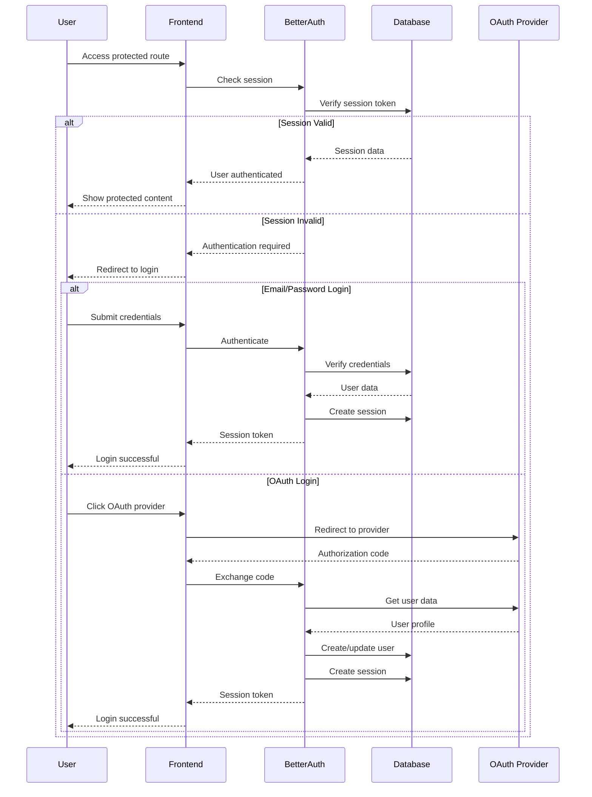

Nuclom uses Better-Auth for comprehensive authentication management, supporting email/password authentication and OAuth providers (GitHub, Google).

## Authentication Flow



## Better-Auth Configuration

### Core Configuration

```typescript
// packages/auth/src/auth.ts
import { betterAuth } from "better-auth";
import { drizzleAdapter } from "better-auth/adapters/drizzle";
import { db } from "./db";

export const auth = betterAuth({
  database: drizzleAdapter(db, {
    provider: "pg",
  }),
  emailAndPassword: {
    enabled: true,
    requireEmailVerification: true,
  },
  socialProviders: {
    github: {
      clientId: process.env.GITHUB_CLIENT_ID as string,
      clientSecret: process.env.GITHUB_CLIENT_SECRET as string,
    },
    google: {
      clientId: process.env.GOOGLE_CLIENT_ID as string,
      clientSecret: process.env.GOOGLE_CLIENT_SECRET as string,
    },
  },
  session: {
    expiresIn: 60 * 60 * 24 * 7, // 7 days
    updateAge: 60 * 60 * 24, // 1 day
  },
});
```

## API Routes

### Authentication Endpoints

```typescript
// apps/saas/src/app/(api)/api/auth/[...better-auth]/route.ts
import { auth } from "@nuclom/auth";
import { toNextJsHandler } from "better-auth/nextjs";

const { GET, POST } = toNextJsHandler(auth);

export { GET, POST };
```

### Available Endpoints

| Endpoint | Description |
| -------- | ----------- |
| `POST /api/auth/sign-in` | Email/password sign in |
| `POST /api/auth/sign-up` | Email/password sign up |
| `POST /api/auth/sign-out` | Sign out |
| `GET /api/auth/session` | Get current session |
| `POST /api/auth/reset-password` | Reset password |
| `POST /api/auth/verify-email` | Verify email |
| `GET /api/auth/oauth/github` | GitHub OAuth |
| `GET /api/auth/oauth/google` | Google OAuth |

## Organization Authorization

Nuclom uses Better Auth's organization plugin with access control for role-based access management.

### Access Control Configuration

```typescript
// packages/lib/src/access-control.ts
import { createAccessControl } from "better-auth/plugins/access";

// Define all resources and their possible actions
export const permissionStatement = {
  video: ["create", "read", "update", "delete", "share", "download", "comment", "manage"],
  channel: ["create", "read", "update", "delete", "manage"],
  collection: ["create", "read", "update", "delete", "share", "manage"],
  comment: ["create", "read", "update", "delete", "comment"],
  member: ["read", "invite", "manage", "admin"],
  settings: ["read", "update", "manage", "admin"],
  billing: ["read", "update", "manage", "admin"],
  analytics: ["read"],
  integration: ["create", "read", "update", "delete", "manage"],
  audit_log: ["read", "download"],
  organization: ["update", "delete"],
  invitation: ["create", "cancel"],
} as const;

export const ac = createAccessControl(permissionStatement);
```

### Role Definitions

<Tabs>
  <Tab title="Owner Role">
    ```typescript
    // Full control
    export const ownerRole = ac.newRole({
      video: ["create", "read", "update", "delete", "share", "download", "comment", "manage"],
      channel: ["create", "read", "update", "delete", "manage"],
      member: ["read", "invite", "manage", "admin"],
      settings: ["read", "update", "manage", "admin"],
      billing: ["read", "update", "manage", "admin"],
      // ... all permissions
    });
    ```
  </Tab>
  <Tab title="Admin Role">
    ```typescript
    // Administrative access (no billing admin)
    export const adminRole = ac.newRole({
      video: ["create", "read", "update", "delete", "share", "download", "comment", "manage"],
      billing: ["read"], // Read-only billing
      // ... other permissions
    });
    ```
  </Tab>
  <Tab title="Editor Role">
    ```typescript
    // Create and edit content
    export const editorRole = ac.newRole({
      video: ["create", "read", "update", "share", "download", "comment"],
      channel: ["read"],
      // ... limited permissions
    });
    ```
  </Tab>
  <Tab title="Member Role">
    ```typescript
    // Read-only access (Viewer)
    export const memberRole = ac.newRole({
      video: ["read", "comment", "download"],
      channel: ["read"],
      // ... read-only permissions
    });
    ```
  </Tab>
</Tabs>

### Permission Checking in API Routes

```typescript
// Example: Check permission in an API route
import { auth } from "@/lib/auth";
import { headers } from "next/headers";

export async function GET(request: NextRequest) {
  const session = await auth.api.getSession({
    headers: await headers(),
  });

  if (!session) {
    return NextResponse.json({ error: "Unauthorized" }, { status: 401 });
  }

  // Check if user has audit_log:read permission
  const hasPermission = await auth.api.hasPermission({
    headers: await headers(),
    body: {
      permissions: {
        audit_log: ["read"],
      },
    },
  });

  if (!hasPermission?.success) {
    return NextResponse.json(
      { error: "You don't have permission to view audit logs" },
      { status: 403 },
    );
  }

  // Continue with the request...
}
```

## Better-Auth Plugins

<AccordionGroup>
  <Accordion title="Admin Plugin">
    ```typescript
    admin({
      defaultRole: "user",
      adminRoles: ["admin"],
      adminUserIds: env.ADMIN_USER_IDS?.split(',').map(id => id.trim()) || [],
      impersonationSessionDuration: 60 * 60, // 1 hour
      defaultBanReason: "Terms of service violation",
      defaultBanExpiresIn: 60 * 60 * 24 * 7, // 7 days
      bannedUserMessage: "Your account has been suspended.",
      allowImpersonatingAdmins: false,
    }),
    ```
  </Accordion>
  <Accordion title="Organization Plugin">
    ```typescript
    organization({
      ac,
      roles: organizationRoles,
      dynamicAccessControl: {
        enabled: true,
        maximumRolesPerOrganization: 10,
      },
      teams: {
        enabled: true,
        maximumTeams: 20,
        allowRemovingAllTeams: true,
      },
      allowUserToCreateOrganization: async () => true,
      organizationLimit: 5,
      creatorRole: "owner",
      membershipLimit: 100,
      invitationExpiresIn: 60 * 60 * 48, // 48 hours
    }),
    ```
  </Accordion>
  <Accordion title="Two-Factor Authentication">
    ```typescript
    twoFactor({
      issuer: "Nuclom",
      totpOptions: {
        digits: 6,
        period: 30,
      },
      backupCodeOptions: {
        length: 10,
        count: 10,
      },
    }),
    ```
  </Accordion>
  <Accordion title="Passkey/WebAuthn">
    ```typescript
    passkey({
      rpID: env.NODE_ENV === "production" ? "nuclom.com" : "localhost",
      rpName: "Nuclom",
      origin: env.NODE_ENV === "production"
        ? "https://nuclom.com"
        : "http://localhost:5001",
    }),
    ```
  </Accordion>
  <Accordion title="API Key">
    ```typescript
    apiKey({
      apiKeyHeaders: ["x-api-key"],
      defaultKeyLength: 64,
      defaultPrefix: "nc_",
      keyExpiration: {
        defaultExpiresIn: 60 * 60 * 24 * 30, // 30 days
      },
      rateLimit: {
        enabled: true,
        timeWindow: 60 * 1000, // 1 minute
        maxRequests: 100,
      },
    }),
    ```
  </Accordion>
</AccordionGroup>

## Teams Feature

Teams provide sub-group management within organizations for granular access control:

```typescript
// Client-side team management
import { createTeam, listTeams, addTeamMember, setActiveTeam } from "@/lib/auth-client";

// Create a team
await createTeam({ name: "Engineering", organizationId: org.id });

// List teams in an organization
const { data: teams } = await listTeams(organizationId);

// Add a member to a team
await addTeamMember({ teamId: team.id, userId: user.id });

// Set active team for session context
await setActiveTeam(teamId);
```

<Note>
**Team Capabilities:**
- Sub-groups within organizations for project/department organization
- Team-specific invitations via `teamId` field
- Active team context stored in sessions (`activeTeamId`)
- Maximum 20 teams per organization (configurable)
</Note>

## Email Verification Flow

<Steps>
  <Step title="User Registration">
    User submits registration form with name, email, and password
  </Step>
  <Step title="Account Creation">
    Better-Auth creates user account with `emailVerified: false`
  </Step>
  <Step title="Verification Email">
    `sendVerificationEmail` handler is triggered automatically
  </Step>
  <Step title="Pending State">
    User is redirected to `/verification-pending?email=...`
  </Step>
  <Step title="Email Delivery">
    Verification email is sent via Resend
  </Step>
</Steps>

### Verification Pages

| Route | Purpose |
|-------|---------|
| `/verification-pending` | Shows after signup, allows resending verification email |
| `/verify-email?token=...` | Handles verification token from email link |

## Security Features

### Session Security

```typescript
// Secure session configuration
export const auth = betterAuth({
  session: {
    expiresIn: 60 * 60 * 24 * 7, // 7 days
    updateAge: 60 * 60 * 24, // Update session every 24 hours
    cookieOptions: {
      secure: process.env.NODE_ENV === "production",
      httpOnly: true,
      sameSite: "strict",
    },
  },
});
```

### CSRF Protection

Better-Auth includes built-in CSRF protection:

```typescript
export const auth = betterAuth({
  csrf: {
    enabled: true,
    sameSite: "strict",
  },
});
```

## Enterprise SSO/SAML

<Warning>
Enterprise SSO requires the Better Auth SSO plugin (`@better-auth/sso`), which provides SAML 2.0 and OIDC protocols.
</Warning>

### SSO Endpoints

| Endpoint | Description |
|----------|-------------|
| `POST /api/auth/sso/register` | Register a new SSO provider |
| `POST /api/auth/sso/request-domain-verification` | Get domain verification token |
| `POST /api/auth/sso/verify-domain` | Verify domain ownership |
| `GET /api/auth/sso/callback/:providerId` | OIDC callback URL |
| `POST /api/auth/sso/saml2/callback/:providerId` | SAML ACS URL |
| `GET /api/auth/sso/saml2/sp/metadata` | SAML SP Metadata |

### Supported Identity Providers

- Okta
- Azure Active Directory (Entra ID)
- Google Workspace
- OneLogin
- PingIdentity
- Auth0
- Any SAML 2.0 or OIDC compliant provider

## Production Considerations

### Environment Variables

```bash
# Required for production
BETTER_AUTH_SECRET=your-secret-key-here
DATABASE_URL=postgresql://...
RESEND_API_KEY=your-resend-api-key
GITHUB_CLIENT_ID=your-github-client-id
GITHUB_CLIENT_SECRET=your-github-client-secret
GOOGLE_CLIENT_ID=your-google-client-id
GOOGLE_CLIENT_SECRET=your-google-client-secret
```

### SSL/TLS Requirements

- HTTPS required for production
- Secure cookies enabled
- Proper redirect URLs for OAuth providers

## Related Documentation

<CardGroup cols={2}>
  <Card title="Security" href="/internal/architecture/security" icon="shield">
    Security architecture
  </Card>
  <Card title="Database Schema" href="/internal/architecture/database" icon="database">
    Auth tables documentation
  </Card>
</CardGroup>
