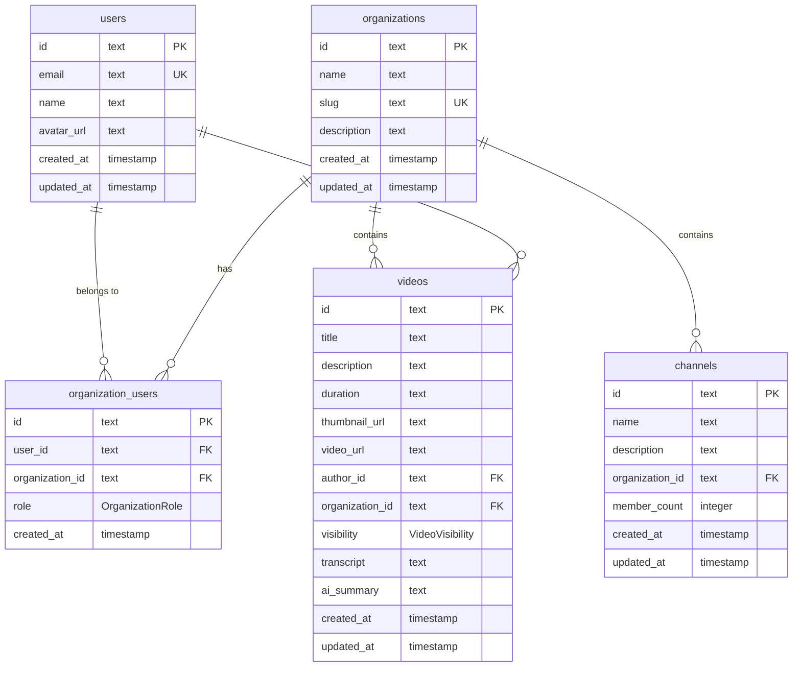

Nuclom uses PostgreSQL with Drizzle ORM for type-safe database operations. The schema is designed for multi-tenant video collaboration with organization-based organization.

## Schema Organization

The database schema is organized into multiple files in `packages/lib/src/db/schema/`:

```
packages/lib/src/db/schema/
├── index.ts              # Re-exports all schema files
├── enums.ts              # All PostgreSQL enum types (centralized)
├── types.ts              # Shared TypeScript types
├── custom-types.ts       # Custom Drizzle types
├── auth.ts               # Better-auth managed tables (DO NOT EDIT directly)
│                         # Includes: users, sessions, accounts, organizations,
│                         # members, invitations, teams, teamMembers, etc.
├── auth-relations.ts     # Relations for auth tables
├── user-extensions.ts    # Application-specific user data (decoupled from auth)
├── videos.ts             # Video and channel tables
├── notifications.ts      # User notification tables
├── billing.ts            # Subscription and payment tables
├── integrations.ts       # External service integrations
├── knowledge.ts          # Knowledge graph tables
├── knowledge-extended.ts # Extended knowledge features (embeddings, clusters)
├── chat.ts               # AI chat knowledge base tables
├── ai-insights.ts        # AI-extracted topics and action items
├── analytics.ts          # Video analytics and metrics
├── speakers.ts           # Speaker diarization tables
├── search.ts             # Semantic search tables
├── legal.ts              # Legal compliance tables
├── audit-logs.ts         # Audit logging tables
├── activity.ts           # Activity feed and webhooks
├── clips.ts              # Video clips and highlights
├── sharing.ts            # Video sharing links
├── workflows.ts          # Workflow templates
├── content.ts            # Content source abstraction
├── github.ts             # GitHub integration tables
├── notion.ts             # Notion integration tables
├── slack.ts              # Slack integration tables
└── vocabulary.ts         # Custom vocabulary for transcription
```

### Working with Better-Auth Tables

<Warning>
The `auth.ts` file contains tables managed by better-auth. **Do not modify these tables directly.**
</Warning>

To update auth schema:
1. Modify better-auth configuration in `packages/auth/src/auth.ts`
2. Run: `pnpm auth:generate`
3. Run: `pnpm db:generate && pnpm db:migrate`

**Decoupling Pattern**: Application-specific user data is stored in `userExtensions` and `userPreferences` tables, not in the `users` table. This makes it easier to update better-auth without migration conflicts.

<CodeGroup>
```typescript Good Pattern
// Good: Store app-specific data in userExtensions
await db.insert(userExtensions).values({
  userId: user.id,
  tosAcceptedAt: new Date(),
  marketingConsent: true,
});
```

```typescript Bad Pattern
// Bad: Don't add columns to users table
// The users table is managed by better-auth
```
</CodeGroup>

## Database Schema



## Core Tables

<AccordionGroup>
  <Accordion title="Users Table">
    Stores user account information and authentication data.

    ```sql
    CREATE TABLE users (
        id TEXT PRIMARY KEY DEFAULT gen_random_uuid(),
        email TEXT UNIQUE NOT NULL,
        name TEXT,
        avatar_url TEXT,
        created_at TIMESTAMP DEFAULT NOW() NOT NULL,
        updated_at TIMESTAMP DEFAULT NOW() NOT NULL
    );
    ```

    **Key Features:**
    - UUID primary keys for security
    - Email uniqueness constraint
    - Soft user profiles (name and avatar optional)
    - Timestamp tracking for audit trails
  </Accordion>

  <Accordion title="Organizations Table">
    Represents team organizations for video collaboration.

    ```sql
    CREATE TABLE organizations (
        id TEXT PRIMARY KEY DEFAULT gen_random_uuid(),
        name TEXT NOT NULL,
        slug TEXT UNIQUE NOT NULL,
        description TEXT,
        created_at TIMESTAMP DEFAULT NOW() NOT NULL,
        updated_at TIMESTAMP DEFAULT NOW() NOT NULL
    );
    ```

    **Key Features:**
    - Human-readable slugs for URL routing
    - Unique slug constraint across all organizations
    - Optional descriptions for organization context
  </Accordion>

  <Accordion title="Organization Users Table">
    Junction table managing user-organization relationships with roles.

    ```sql
    CREATE TABLE organization_users (
        id TEXT PRIMARY KEY DEFAULT gen_random_uuid(),
        user_id TEXT NOT NULL REFERENCES users(id) ON DELETE CASCADE,
        organization_id TEXT NOT NULL REFERENCES organizations(id) ON DELETE CASCADE,
        role OrganizationRole DEFAULT 'MEMBER' NOT NULL,
        created_at TIMESTAMP DEFAULT NOW() NOT NULL,
        UNIQUE(user_id, organization_id)
    );

    CREATE TYPE OrganizationRole AS ENUM ('OWNER', 'ADMIN', 'MEMBER');
    ```

    **Key Features:**
    - Many-to-many relationship between users and organizations
    - Role-based access control with enum constraint
    - Unique constraint prevents duplicate memberships
    - Cascade deletion for data consistency
  </Accordion>

  <Accordion title="Videos Table">
    Central table for video content and metadata.

    ```sql
    CREATE TABLE videos (
        id TEXT PRIMARY KEY DEFAULT gen_random_uuid(),
        title TEXT NOT NULL,
        description TEXT,
        duration TEXT NOT NULL,
        thumbnail_url TEXT,
        video_url TEXT,
        author_id TEXT REFERENCES users(id),
        organization_id TEXT NOT NULL REFERENCES organizations(id) ON DELETE CASCADE,
        channel_id TEXT REFERENCES channels(id),
        transcript TEXT,
        transcript_segments JSONB,
        processing_status ProcessingStatus DEFAULT 'pending' NOT NULL,
        ai_summary TEXT,
        ai_tags JSONB,
        search_vector TSVECTOR,
        deleted_at TIMESTAMP,
        created_at TIMESTAMP DEFAULT NOW() NOT NULL,
        updated_at TIMESTAMP DEFAULT NOW() NOT NULL
    );
    ```

    **Key Features:**
    - Flexible organization through channels and collections
    - AI-generated content (transcript, summary)
    - Author attribution and organization isolation
    - Optional categorization (channel/collection can be null)
  </Accordion>
</AccordionGroup>

## Video Visibility

Videos have a `visibility` field that controls who can access them:

| Visibility | Description |
| ---------- | ----------- |
| `private` | Only the author can see the video. Can be shared with specific users or teams via `video_shares` table. |
| `organization` | All organization members can view (default). This maintains backward compatibility with existing videos. |
| `public` | Anyone with the URL can view without authentication. |

```sql
CREATE TYPE "VideoVisibility" AS ENUM ('private', 'organization', 'public');

-- Added to videos table
ALTER TABLE videos ADD COLUMN visibility "VideoVisibility" NOT NULL DEFAULT 'organization';
CREATE INDEX videos_visibility_idx ON videos(visibility);
CREATE INDEX videos_org_visibility_idx ON videos(organization_id, visibility);
```

## Video Shares Table

Stores direct sharing relationships for private videos with specific users or teams.

```sql
CREATE TABLE video_shares (
    id TEXT PRIMARY KEY DEFAULT gen_random_uuid(),
    video_id TEXT NOT NULL REFERENCES videos(id) ON DELETE CASCADE,
    user_id TEXT REFERENCES users(id) ON DELETE CASCADE,  -- Share with specific user
    team_id TEXT REFERENCES teams(id) ON DELETE CASCADE,  -- Share with entire team
    access_level "VideoShareLinkAccess" NOT NULL DEFAULT 'view',  -- 'view' | 'comment' | 'download'
    shared_by TEXT NOT NULL REFERENCES users(id) ON DELETE CASCADE,
    created_at TIMESTAMP DEFAULT NOW() NOT NULL
);
```

<Note>
**Key Features:**
- **Flexible Sharing**: Share with individual users or entire teams
- **Access Levels**: `view` (read-only), `comment` (can add comments), `download` (full access)
- **Mutually Exclusive**: Each share is either user-based OR team-based, not both
- **Cascade Deletion**: Shares are removed when video, user, or team is deleted
</Note>

## Indexing Strategy

<Tabs>
  <Tab title="Primary Indexes">
    - All primary keys (UUID) are automatically indexed
    - Foreign key columns are indexed for join performance

    ```sql
    -- Video queries by organization
    CREATE INDEX idx_videos_organization_id ON videos(organization_id);

    -- Progress queries by user
    CREATE INDEX idx_video_progress_user_id ON video_progress(user_id);

    -- Organization member queries
    CREATE INDEX idx_organization_users_organization_id ON organization_users(organization_id);
    ```
  </Tab>
  <Tab title="Composite Indexes">
    ```sql
    -- Video filtering by organization and channel
    CREATE INDEX idx_videos_organization_channel ON videos(organization_id, channel_id);
    ```
  </Tab>
</Tabs>

## Semantic Search Tables

<Tip>
Semantic search enables finding content by meaning rather than exact keywords. See [semantic-search.mdx](/internal/architecture/semantic-search) for full documentation.
</Tip>

### transcript_chunks Table

Stores chunked transcript segments with vector embeddings for semantic search.

```sql
CREATE TABLE transcript_chunks (
    id UUID PRIMARY KEY DEFAULT gen_random_uuid(),
    video_id TEXT NOT NULL REFERENCES videos(id) ON DELETE CASCADE,
    organization_id TEXT NOT NULL REFERENCES organizations(id) ON DELETE CASCADE,
    chunk_index INTEGER NOT NULL,
    text TEXT NOT NULL,
    token_count INTEGER,
    timestamp_start INTEGER,  -- seconds into video
    timestamp_end INTEGER,
    speakers TEXT[],
    embedding vector(1536),   -- OpenAI text-embedding-3-small
    created_at TIMESTAMP DEFAULT NOW() NOT NULL,
    UNIQUE(video_id, chunk_index)
);

-- HNSW index for fast similarity search
CREATE INDEX transcript_chunks_embedding_idx
    ON transcript_chunks
    USING hnsw (embedding vector_cosine_ops)
    WITH (m = 16, ef_construction = 64);
```

**Key Features:**
- Vector embeddings for semantic similarity search
- Timestamp mapping for video context
- HNSW index for sub-linear search time
- Organization isolation for multi-tenancy

## Migration Strategy

<CodeGroup>
```bash Development
# Generate migration files
pnpm db:generate

# Apply migrations to database
pnpm db:migrate

# Push schema changes (development)
pnpm db:push
```

```bash Production
# Run migrations in production
NODE_ENV=production pnpm db:migrate
```
</CodeGroup>

### Schema Changes

- **Backward Compatibility**: Migrations maintain backward compatibility
- **Rollback Strategy**: Database backups before major schema changes
- **Testing**: Migration testing in staging environment

## Security Considerations

<CardGroup cols={2}>
  <Card title="Row-Level Security" icon="shield">
    - **Organization Isolation**: Users can only access their organization content
    - **Role-Based Access**: Different permissions based on organization role
    - **Data Isolation**: Prevents cross-tenant data access
  </Card>
  <Card title="Data Validation" icon="check">
    - **NOT NULL Constraints**: Required fields are enforced
    - **Unique Constraints**: Prevent duplicate records
    - **Foreign Key Constraints**: Maintain referential integrity
  </Card>
</CardGroup>

## Performance Optimization

<AccordionGroup>
  <Accordion title="Query Optimization">
    - **Selective Queries**: Only fetch required columns
    - **Join Optimization**: Efficient join strategies
    - **Pagination**: Limit result sets for large datasets
  </Accordion>
  <Accordion title="Connection Pooling">
    - **PostgreSQL**: Connection pooling for scalability
    - **Drizzle**: Efficient connection management
    - **Resource Limits**: Prevent connection exhaustion
  </Accordion>
  <Accordion title="Data Archiving">
    - **Soft Deletion**: Mark records as deleted instead of removing
    - **Archive Strategy**: Move old data to archive tables
    - **Retention Policy**: Automated cleanup of old data
  </Accordion>
</AccordionGroup>

## Future Enhancements

<CardGroup cols={2}>
  <Card title="Scaling Considerations" icon="arrows-up-down">
    - **Read Replicas**: Distribute read load
    - **Sharding**: Horizontal scaling for large datasets
    - **Caching**: Redis for frequently accessed data
  </Card>
  <Card title="Advanced Features" icon="sparkles">
    - **Full-Text Search**: PostgreSQL full-text search
    - **Semantic Search**: Vector-based similarity search with pgvector
    - **Hybrid Search**: Combined keyword and semantic ranking
    - **JSON Columns**: Flexible metadata storage
  </Card>
</CardGroup>
