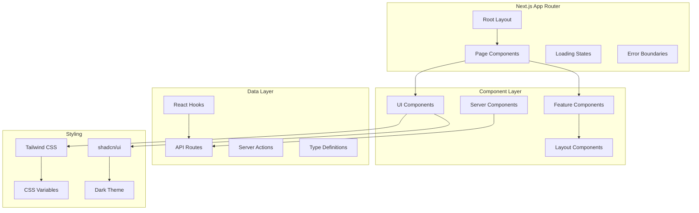

Nuclom's frontend is built with Next.js 16 App Router, leveraging React 19 Server Components for optimal performance and developer experience.

## Architecture Overview



## Directory Structure

```
src/
├── app/                    # Next.js App Router
│   ├── (main)/            # Route groups
│   │   └── [organization]/   # Dynamic organization routes
│   ├── api/               # API routes
│   ├── globals.css        # Global styles
│   └── layout.tsx         # Root layout
├── components/            # React components
│   ├── ui/               # shadcn/ui components
│   ├── feature/          # Feature-specific components
│   └── layout/           # Layout components
├── hooks/                # Custom React hooks
├── lib/                  # Utility libraries
│   ├── api.ts           # API client
│   ├── auth.ts          # Authentication
│   ├── db/              # Database schema
│   └── utils.ts         # Utility functions
└── types/               # TypeScript type definitions
```

## Routing Architecture

### App Router Structure

```
app/
├── page.tsx                    # Home page
├── layout.tsx                  # Root layout
├── (main)/                     # Route group for authenticated pages
│   └── [organization]/           # Dynamic organization routing
│       ├── layout.tsx         # Organization layout
│       ├── page.tsx           # Organization dashboard
│       ├── videos/
│       │   ├── page.tsx       # Video list
│       │   └── [id]/
│       │       └── page.tsx   # Video detail
│       ├── channels/
│       ├── series/
│       ├── search/
│       └── settings/
└── api/                       # API routes
    ├── auth/
    ├── videos/
    ├── organizations/
    └── ai/
```

### Dynamic Routing

<CardGroup cols={2}>
  <Card title="Organization-based" icon="building">
    `[organization]` parameter for multi-tenancy
  </Card>
  <Card title="Content-specific" icon="file">
    `[id]` parameters for individual resources
  </Card>
  <Card title="Type-safe" icon="shield-check">
    Parameter validation with TypeScript
  </Card>
  <Card title="SEO-friendly" icon="magnifying-glass">
    Meaningful URLs with organization slugs
  </Card>
</CardGroup>

## Component Types

<Tabs>
  <Tab title="Server Components">
    ```typescript
    // Server Component example
    export default async function VideoList({
      organizationId,
    }: {
      organizationId: string;
    }) {
      const videos = await getVideos(organizationId);

      return (
        <div className="grid grid-cols-1 md:grid-cols-2 lg:grid-cols-3 gap-6">
          {videos.map((video) => (
            <VideoCard key={video.id} video={video} />
          ))}
        </div>
      );
    }
    ```
  </Tab>
  <Tab title="Client Components">
    ```typescript
    "use client";

    import { useState } from "react";
    import { useVideo } from "@/hooks/use-api";

    export default function VideoPlayer({ videoId }: { videoId: string }) {
      const [currentTime, setCurrentTime] = useState(0);
      const { data: video, isLoading } = useVideo(videoId);

      if (isLoading) return <VideoPlayerSkeleton />;

      return (
        <div className="video-player">
          <video
            src={video.videoUrl}
            onTimeUpdate={(e) => setCurrentTime(e.currentTarget.currentTime)}
          />
          <VideoControls currentTime={currentTime} />
        </div>
      );
    }
    ```
  </Tab>
  <Tab title="UI Components">
    ```typescript
    import { Button } from "@/components/ui/button";
    import { Input } from "@/components/ui/input";
    import { Card, CardContent, CardHeader, CardTitle } from "@/components/ui/card";

    export function VideoUploadForm() {
      return (
        <Card>
          <CardHeader>
            <CardTitle>Upload Video</CardTitle>
          </CardHeader>
          <CardContent>
            <form className="space-y-4">
              <Input placeholder="Video title" />
              <Input type="file" accept="video/*" />
              <Button type="submit">Upload</Button>
            </form>
          </CardContent>
        </Card>
      );
    }
    ```
  </Tab>
</Tabs>

## State Management

### React Hooks Pattern

```typescript
// Custom hook for video data
export function useVideo(videoId: string) {
  const [video, setVideo] = useState<VideoWithDetails | null>(null);
  const [loading, setLoading] = useState(true);
  const [error, setError] = useState<string | null>(null);

  useEffect(() => {
    async function fetchVideo() {
      try {
        setLoading(true);
        const data = await videoApi.getVideo(videoId);
        setVideo(data);
      } catch (err) {
        setError(err instanceof Error ? err.message : "Failed to load video");
      } finally {
        setLoading(false);
      }
    }

    fetchVideo();
  }, [videoId]);

  return { video, loading, error };
}
```

### Context Providers

```typescript
// Organization context
export const OrganizationContext = createContext<{
  currentOrganization: Organization | null;
  organizations: Organization[];
  switchOrganization: (organizationId: string) => void;
} | null>(null);

export function OrganizationProvider({
  children,
}: {
  children: React.ReactNode;
}) {
  const [currentOrganization, setCurrentOrganization] =
    useState<Organization | null>(null);
  const [organizations, setOrganizations] = useState<Organization[]>([]);

  const switchOrganization = useCallback(
    (organizationId: string) => {
      const organization = organizations.find((w) => w.id === organizationId);
      if (organization) {
        setCurrentOrganization(organization);
      }
    },
    [organizations]
  );

  return (
    <OrganizationContext.Provider
      value={{
        currentOrganization,
        organizations,
        switchOrganization,
      }}
    >
      {children}
    </OrganizationContext.Provider>
  );
}
```

## Performance Optimizations

### Partial Prerendering (PPR)

<Note>
Nuclom uses Next.js Partial Prerendering to combine static and dynamic rendering in the same route.
</Note>

PPR is enabled globally via `cacheComponents` in `next.config.ts`:

```typescript
const nextConfig: NextConfig = {
  cacheComponents: true,
  // ... other config
};
```

#### How PPR Works

PPR allows the static shell of a page to be served instantly from the CDN, while dynamic content streams in progressively:

1. **Static Shell**: Layout, navigation, and skeleton UI are prerendered at build time
2. **Dynamic Holes**: Content wrapped in `<Suspense>` boundaries streams in after the initial load
3. **Instant TTFB**: Users see the page structure immediately

#### PPR in Practice

```typescript
// Dashboard page with PPR
export default async function DashboardPage() {
  return (
    <div className="space-y-8">
      {/* Static: Hero section can be prerendered */}
      <DashboardHero />

      {/* Dynamic: Video content streams in */}
      <Suspense fallback={<VideoGridSkeleton />}>
        <DynamicVideoContent />
      </Suspense>

      {/* Dynamic: Personalized activity feed */}
      <Suspense fallback={<ActivitySkeleton />}>
        <ActivityFeed />
      </Suspense>
    </div>
  );
}
```

<Tip>
**Best Practices for PPR:**
- Wrap all data-fetching components in `<Suspense>` boundaries
- Use skeleton components that match the layout of actual content
- Keep the static shell minimal for fastest TTFB
- Nest Suspense boundaries for granular loading states
</Tip>

### Code Splitting

```typescript
// Dynamic imports for large components
const VideoEditor = dynamic(() => import("@/components/video-editor"), {
  loading: () => <VideoEditorSkeleton />,
  ssr: false,
});

// Route-based code splitting (automatic with App Router)
export default function VideoPage() {
  return (
    <Suspense fallback={<VideoPageSkeleton />}>
      <VideoContent />
    </Suspense>
  );
}
```

### Image Optimization

```typescript
import Image from "next/image";

export function VideoThumbnail({
  src,
  alt,
  width = 320,
  height = 180,
}: {
  src: string;
  alt: string;
  width?: number;
  height?: number;
}) {
  return (
    <Image
      src={src}
      alt={alt}
      width={width}
      height={height}
      className="rounded-lg object-cover"
      placeholder="blur"
      blurDataURL="data:image/jpeg;base64,..."
    />
  );
}
```

## Styling Architecture

### CSS Variables System

```css
/* globals.css */
@tailwind base;
@tailwind components;
@tailwind utilities;

@layer base {
  :root {
    --background: 0 0% 100%;
    --foreground: 222.2 84% 4.9%;
    --primary: 222.2 47.4% 11.2%;
    --primary-foreground: 210 40% 98%;
    /* ... more variables */
  }

  .dark {
    --background: 222.2 84% 4.9%;
    --foreground: 210 40% 98%;
    --primary: 210 40% 98%;
    --primary-foreground: 222.2 47.4% 11.2%;
    /* ... more variables */
  }
}
```

## Error Handling

### Error Boundaries

```typescript
"use client";

import { Component, type ReactNode } from "react";
import { Button } from "@/components/ui/button";

interface ErrorBoundaryState {
  hasError: boolean;
  error?: Error;
}

export class ErrorBoundary extends Component<
  { children: ReactNode },
  ErrorBoundaryState
> {
  constructor(props: { children: ReactNode }) {
    super(props);
    this.state = { hasError: false };
  }

  static getDerivedStateFromError(error: Error): ErrorBoundaryState {
    return { hasError: true, error };
  }

  render() {
    if (this.state.hasError) {
      return (
        <div className="flex flex-col items-center justify-center min-h-96 space-y-4">
          <h2 className="text-2xl font-bold">Something went wrong</h2>
          <p className="text-muted-foreground">
            {this.state.error?.message || "An unexpected error occurred"}
          </p>
          <Button onClick={() => this.setState({ hasError: false })}>
            Try again
          </Button>
        </div>
      );
    }

    return this.props.children;
  }
}
```

### Loading States

```typescript
// Loading skeleton components
export function VideoCardSkeleton() {
  return (
    <Card>
      <CardContent className="p-0">
        <Skeleton className="w-full h-48 rounded-t-lg" />
        <div className="p-4 space-y-2">
          <Skeleton className="h-4 w-3/4" />
          <Skeleton className="h-4 w-1/2" />
        </div>
      </CardContent>
    </Card>
  );
}

export function VideoGridSkeleton() {
  return (
    <div className="grid grid-cols-1 md:grid-cols-2 lg:grid-cols-3 gap-6">
      {Array.from({ length: 6 }).map((_, i) => (
        <VideoCardSkeleton key={i} />
      ))}
    </div>
  );
}
```

## TypeScript Integration

### Type-Safe Forms

```typescript
import { useForm } from "react-hook-form";
import { effectSchemaResolver } from "@hookform/resolvers/effect-schema";

const videoSchema = z.object({
  title: z.string().min(1, "Title is required"),
  description: z.string().optional(),
  channelId: z.string().optional(),
});

type VideoFormData = z.infer<typeof videoSchema>;

export function VideoForm() {
  const form = useForm<VideoFormData>({
    resolver: effectSchemaResolver(videoSchema),
    defaultValues: {
      title: "",
      description: "",
    },
  });

  const onSubmit = (data: VideoFormData) => {
    // Type-safe form submission
    console.log(data);
  };

  return (
    <form onSubmit={form.handleSubmit(onSubmit)}>{/* Form fields */}</form>
  );
}
```

## Future Enhancements

<CardGroup cols={2}>
  <Card title="Progressive Web App" icon="mobile">
    - Service worker for offline functionality
    - Push notifications for comments
    - App manifest for installation
    - Background sync for uploads
  </Card>
  <Card title="Real-time Features" icon="bolt">
    - WebSocket integration for live comments
    - Real-time collaboration features
    - Live streaming capabilities
    - Presence indicators
  </Card>
  <Card title="Advanced Components" icon="puzzle-piece">
    - Virtual scrolling for large lists
    - Infinite scroll for video feeds
    - Drag and drop file uploads
    - Rich text editor for descriptions
  </Card>
  <Card title="Performance Improvements" icon="gauge-high">
    - Server-side caching strategies
    - Client-side caching with SWR
    - Image optimization pipeline
    - Video streaming optimization
  </Card>
</CardGroup>
