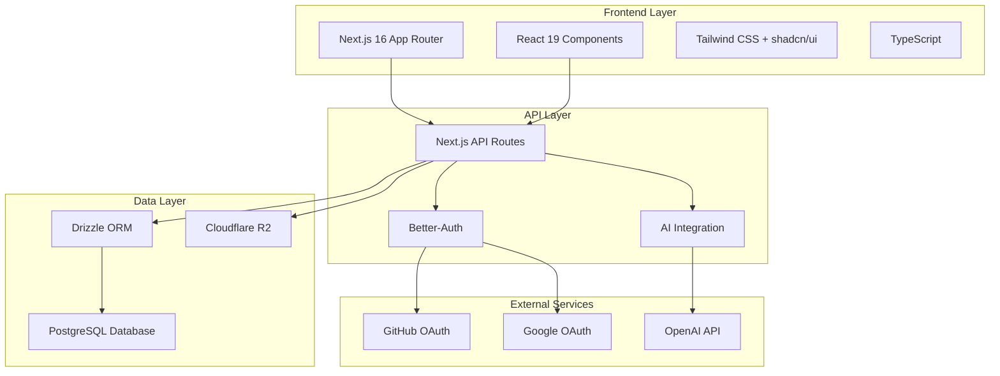

# Nuclom Platform Architecture

Nuclom is a video collaboration platform built with modern web technologies, designed for teams to share, organize, and collaborate on video content.

## High-Level Architecture

## Core Components

### 1. Frontend Architecture

- **Framework**: Next.js 16 with App Router
- **Styling**: Tailwind CSS with shadcn/ui component library
- **State Management**: React hooks and context
- **Type Safety**: TypeScript with strict configuration
- **Theme**: Dark-first design with next-themes

### 2. Backend Architecture

- **API**: Next.js API Routes with RESTful design
- **Database**: PostgreSQL with Drizzle ORM
- **Authentication**: Better-Auth with OAuth providers
- **File Storage**: Cloudflare R2 for video assets
- **AI Integration**: OpenAI for video analysis and summaries

### 3. Data Architecture

- **Database**: PostgreSQL hosted on cloud provider
- **ORM**: Drizzle with type-safe queries
- **Migrations**: Automated schema migrations
- **Relationships**: Normalized relational design

## Key Features

### Video Collaboration

- Video upload and streaming
- Real-time comments with timestamps
- AI-powered summaries and action items
- Video progress tracking
- Organization-based organization

### User Management

- Multi-organization support
- Role-based access control (Owner, Admin, Member)
- OAuth authentication (GitHub, Google)
- Session management

### Content Organization

- Organizations for team collaboration
- Channels for categorization
- Series for sequential content
- Search and filtering capabilities

## Technology Stack

### Frontend

- **Next.js 16**: React framework with App Router
- **React 19**: UI library with Server Components
- **TypeScript**: Type safety and developer experience
- **Tailwind CSS**: Utility-first CSS framework
- **shadcn/ui**: Accessible UI components
- **Lucide React**: Icon library

### Backend

- **Next.js API Routes**: Server-side API endpoints
- **Better-Auth**: Authentication and session management
- **Drizzle ORM**: Type-safe database queries
- **PostgreSQL**: Relational database
- **Cloudflare R2**: Object storage for videos

### DevOps & Tools

- **Vercel**: Deployment platform
- **Biome**: Code formatting and linting
- **Drizzle Kit**: Database migrations
- **pnpm**: Package manager

## Security Considerations

### Authentication

- OAuth 2.0 with GitHub and Google
- Session-based authentication
- CSRF protection
- Email verification (configurable)

### Data Protection

- Input validation and sanitization
- SQL injection prevention through ORM
- Role-based access control
- Secure file upload handling

### Infrastructure

- HTTPS everywhere
- Environment variable management
- Database connection pooling
- Rate limiting (to be implemented)

## Performance Optimizations

### Frontend

- Server-side rendering with App Router
- Component-level code splitting
- Image optimization
- Responsive design

### Backend

- Database query optimization
- Connection pooling
- Caching strategies (to be implemented)
- File CDN distribution

## Scalability Considerations

### Database

- Indexed queries for performance
- Normalized schema design
- Connection pooling
- Read replicas (future)

### File Storage

- CDN distribution via Cloudflare R2
- Streaming video delivery
- Thumbnail generation
- Compression optimization

## Development Workflow

### Local Development

1. Clone repository
2. Install dependencies with `pnpm install`
3. Set up environment variables
4. Run database migrations
5. Start development server

### Deployment

1. Database migrations in production
2. Environment configuration
3. Vercel deployment
4. CDN setup for assets

## Monitoring & Observability

### Application Monitoring

- Error tracking (to be implemented)
- Performance monitoring
- User analytics
- API metrics

### Database Monitoring

- Query performance
- Connection pool status
- Storage utilization
- Backup verification

## Future Enhancements

### Technical Improvements

- Real-time collaboration features
- Advanced caching strategies
- Mobile application
- Offline capabilities

### Feature Enhancements

- Video transcription
- Advanced search capabilities
- Integration with external tools
- Analytics dashboard

## Related Documentation

- [Database Schema](./database.md) - Complete database design and relationships
- [Frontend Architecture](./frontend.md) - Next.js App Router and component structure
- [Authentication Flow](./authentication.md) - Better-Auth implementation and security
- [Deployment Guide](./deployment.md) - Infrastructure and CI/CD pipeline
- [Architecture Summary](./summary.md) - Quick reference and overview
