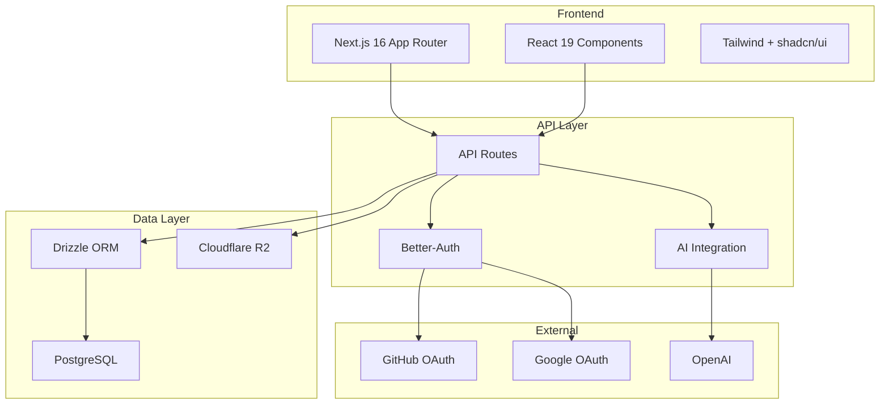

# Platform Architecture

> High-level system design for the Nuclom video collaboration platform.

---

## System Overview



---

## Architecture at a Glance

| Layer | Technology | Purpose |
| ----- | ---------- | ------- |
| **Frontend** | Next.js 16, React 19 | Server Components, App Router |
| **Styling** | Tailwind CSS, shadcn/ui | Utility-first CSS, accessible components |
| **Backend** | Next.js API Routes | RESTful endpoints |
| **Database** | PostgreSQL, Drizzle ORM | Relational data, type-safe queries |
| **Auth** | Better-Auth | OAuth (GitHub, Google), sessions |
| **Storage** | Cloudflare R2 | Video files, thumbnails |
| **AI** | OpenAI, Vercel AI SDK | Video analysis, summaries |

---

## Core Components

### Frontend

- **Framework:** Next.js 16 with App Router
- **UI Library:** React 19 with Server Components
- **Styling:** Tailwind CSS with shadcn/ui components
- **State:** React hooks and context
- **Theme:** Dark-first design with next-themes

### Backend

- **API:** RESTful endpoints via Next.js API Routes
- **Validation:** Effect Schema for request validation
- **Error Handling:** Effect-TS for type-safe errors
- **Database:** Drizzle ORM with PostgreSQL

### Data

- **Primary Database:** PostgreSQL (relational)
- **ORM:** Drizzle with full type safety
- **File Storage:** Cloudflare R2 (S3-compatible)
- **Migrations:** Automated with Drizzle Kit

---

## Key Features

| Feature | Implementation |
| ------- | -------------- |
| **Multi-organization** | Organization-based routing with permissions |
| **Video streaming** | R2 storage with CDN distribution |
| **Real-time comments** | Time-stamped, threaded discussions |
| **AI summaries** | OpenAI with structured outputs (Effect Schema) |
| **Role-based access** | Owner, Admin, Member permissions |
| **OAuth login** | GitHub and Google providers |

---

## Security

### Authentication

- OAuth 2.0 with GitHub and Google
- Session-based auth with secure cookies
- CSRF protection built-in
- Email verification (optional)

### Authorization

- Role-based access control per organization
- Resource-level permission checks
- Input validation on all endpoints

### Infrastructure

- HTTPS everywhere
- Environment variable management
- Database connection pooling
- SQL injection prevention via ORM

---

## Performance

### Frontend

| Strategy | Implementation |
| -------- | -------------- |
| SSR | Server-side rendering with App Router |
| Code splitting | Route-based automatic splitting |
| Image optimization | Next.js Image component |
| Caching | Static generation where possible |

### Backend

| Strategy | Implementation |
| -------- | -------------- |
| Database | Indexed queries, connection pooling |
| Storage | CDN distribution via R2 |
| API | Edge-optimized endpoints |

---

## Scalability

### Horizontal

- Serverless architecture (auto-scaling)
- CDN for global content delivery
- Stateless API design

### Vertical

- Query optimization
- Connection pooling
- Caching layers (planned)

---

## Documentation Index

| Document | Description |
| -------- | ----------- |
| [Summary](summary.md) | Quick reference (20 key decisions) |
| [Database](database.md) | Schema, relationships, indexes |
| [Frontend](frontend.md) | Components, routing, state |
| [Backend](backend.md) | API design, validation |
| [Authentication](authentication.md) | Better-Auth, OAuth, sessions |
| [Video Processing](video-processing.md) | Upload, streaming, thumbnails |
| [Effect-TS](effect-ts.md) | Error handling patterns |
| [Deployment](deployment.md) | Infrastructure, CI/CD |
| [Security](security.md) | Security architecture |

---

## Development Workflow

### Local Setup

```bash
git clone https://github.com/SferaDev/nuclom.git
cd nuclom
pnpm install
cp .env.example .env.local
pnpm db:migrate
pnpm dev
```

### Deployment

1. Push to main branch
2. CI/CD runs tests and type checks
3. Deploy to Vercel
4. Run database migrations
5. Health checks verify deployment

---

## Related Documentation

- **Development:** [Development Setup](../reference/development-setup.md)
- **API:** [API Documentation](../../public/api/README.md)
- **User Guides:** [Getting Started](../../public/guides/getting-started.md)
