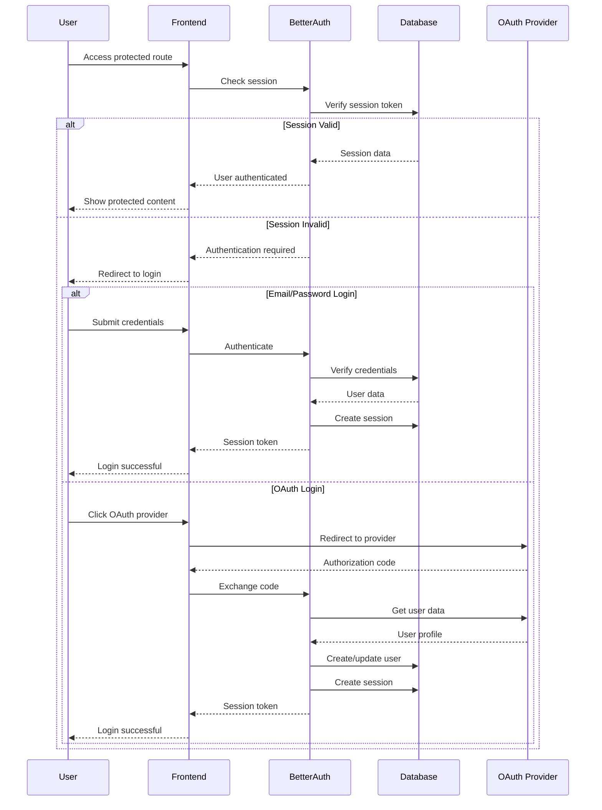

# Authentication Architecture

Nuclom uses Better-Auth for comprehensive authentication management, supporting email/password authentication and OAuth providers (GitHub, Google).

## Authentication Flow



## Better-Auth Configuration

### Core Configuration

```typescript
// src/lib/auth.ts
import { betterAuth } from "better-auth";
import { drizzleAdapter } from "better-auth/adapters/drizzle";
import { db } from "./db";

export const auth = betterAuth({
  database: drizzleAdapter(db, {
    provider: "pg",
  }),
  emailAndPassword: {
    enabled: true,
    requireEmailVerification: true,
    // sendVerificationEmail handler is configured in src/lib/auth.ts
  },
  socialProviders: {
    github: {
      clientId: process.env.GITHUB_CLIENT_ID as string,
      clientSecret: process.env.GITHUB_CLIENT_SECRET as string,
    },
    google: {
      clientId: process.env.GOOGLE_CLIENT_ID as string,
      clientSecret: process.env.GOOGLE_CLIENT_SECRET as string,
    },
  },
  session: {
    expiresIn: 60 * 60 * 24 * 7, // 7 days
    updateAge: 60 * 60 * 24, // 1 day
  },
});
```

### Database Schema for Authentication

Better-Auth automatically creates and manages these tables:

```sql
-- Users table (managed by Better-Auth)
CREATE TABLE user (
    id TEXT PRIMARY KEY,
    email TEXT UNIQUE NOT NULL,
    emailVerified BOOLEAN DEFAULT FALSE,
    name TEXT,
    image TEXT,
    createdAt TIMESTAMP DEFAULT CURRENT_TIMESTAMP,
    updatedAt TIMESTAMP DEFAULT CURRENT_TIMESTAMP
);

-- Sessions table (managed by Better-Auth)
CREATE TABLE session (
    id TEXT PRIMARY KEY,
    userId TEXT NOT NULL,
    token TEXT UNIQUE NOT NULL,
    expiresAt TIMESTAMP NOT NULL,
    createdAt TIMESTAMP DEFAULT CURRENT_TIMESTAMP,
    FOREIGN KEY (userId) REFERENCES user(id) ON DELETE CASCADE
);

-- OAuth accounts table (managed by Better-Auth)
CREATE TABLE account (
    id TEXT PRIMARY KEY,
    userId TEXT NOT NULL,
    provider TEXT NOT NULL,
    providerAccountId TEXT NOT NULL,
    accessToken TEXT,
    refreshToken TEXT,
    expiresAt TIMESTAMP,
    createdAt TIMESTAMP DEFAULT CURRENT_TIMESTAMP,
    FOREIGN KEY (userId) REFERENCES user(id) ON DELETE CASCADE,
    UNIQUE(provider, providerAccountId)
);
```

## API Routes

### Authentication Endpoints

```typescript
// src/app/api/auth/[...better-auth]/route.ts
import { auth } from "@/lib/auth";
import { toNextJsHandler } from "better-auth/nextjs";

const { GET, POST } = toNextJsHandler(auth);

export { GET, POST };
```

### Available Endpoints

Better-Auth provides these endpoints automatically:

```
POST /api/auth/sign-in              # Email/password sign in
POST /api/auth/sign-up              # Email/password sign up
POST /api/auth/sign-out             # Sign out
GET  /api/auth/session              # Get current session
POST /api/auth/reset-password       # Reset password
POST /api/auth/verify-email         # Verify email
GET  /api/auth/oauth/github         # GitHub OAuth
GET  /api/auth/oauth/google         # Google OAuth
```

## Client-Side Authentication

### React Hook for Authentication

```typescript
// src/hooks/use-auth.ts
import { useEffect, useState } from "react";
import type { User } from "better-auth";

interface AuthState {
  user: User | null;
  isLoading: boolean;
  isAuthenticated: boolean;
}

export function useAuth(): AuthState {
  const [authState, setAuthState] = useState<AuthState>({
    user: null,
    isLoading: true,
    isAuthenticated: false,
  });

  useEffect(() => {
    async function checkAuth() {
      try {
        const response = await fetch("/api/auth/session");
        if (response.ok) {
          const { user } = await response.json();
          setAuthState({
            user,
            isLoading: false,
            isAuthenticated: !!user,
          });
        } else {
          setAuthState({
            user: null,
            isLoading: false,
            isAuthenticated: false,
          });
        }
      } catch (error) {
        setAuthState({
          user: null,
          isLoading: false,
          isAuthenticated: false,
        });
      }
    }

    checkAuth();
  }, []);

  return authState;
}
```

### Authentication Functions

```typescript
// src/lib/auth-client.ts
interface SignInData {
  email: string;
  password: string;
}

interface SignUpData {
  email: string;
  password: string;
  name?: string;
}

export const authClient = {
  async signIn(data: SignInData) {
    const response = await fetch("/api/auth/sign-in", {
      method: "POST",
      headers: {
        "Content-Type": "application/json",
      },
      body: JSON.stringify(data),
    });

    if (!response.ok) {
      throw new Error("Sign in failed");
    }

    return response.json();
  },

  async signUp(data: SignUpData) {
    const response = await fetch("/api/auth/sign-up", {
      method: "POST",
      headers: {
        "Content-Type": "application/json",
      },
      body: JSON.stringify(data),
    });

    if (!response.ok) {
      throw new Error("Sign up failed");
    }

    return response.json();
  },

  async signOut() {
    const response = await fetch("/api/auth/sign-out", {
      method: "POST",
    });

    if (!response.ok) {
      throw new Error("Sign out failed");
    }

    return response.json();
  },

  async getSession() {
    const response = await fetch("/api/auth/session");

    if (!response.ok) {
      return null;
    }

    const { user } = await response.json();
    return user;
  },
};
```

## Authentication Components

### Login Form

```typescript
// src/components/auth/login-form.tsx
"use client";

import { useState } from "react";
import { useRouter } from "next/navigation";
import { Button } from "@/components/ui/button";
import { Input } from "@/components/ui/input";
import { Label } from "@/components/ui/label";
import { Card, CardContent, CardHeader, CardTitle } from "@/components/ui/card";
import { authClient } from "@/lib/auth-client";

export function LoginForm() {
  const [email, setEmail] = useState("");
  const [password, setPassword] = useState("");
  const [isLoading, setIsLoading] = useState(false);
  const [error, setError] = useState("");
  const router = useRouter();

  const handleSubmit = async (e: React.FormEvent) => {
    e.preventDefault();
    setIsLoading(true);
    setError("");

    try {
      await authClient.signIn({ email, password });
      router.push("/dashboard");
    } catch (err) {
      setError("Invalid email or password");
    } finally {
      setIsLoading(false);
    }
  };

  return (
    <Card className="w-full max-w-md">
      <CardHeader>
        <CardTitle>Sign In</CardTitle>
      </CardHeader>
      <CardContent>
        <form onSubmit={handleSubmit} className="space-y-4">
          <div className="space-y-2">
            <Label htmlFor="email">Email</Label>
            <Input
              id="email"
              type="email"
              value={email}
              onChange={(e) => setEmail(e.target.value)}
              required
            />
          </div>
          <div className="space-y-2">
            <Label htmlFor="password">Password</Label>
            <Input
              id="password"
              type="password"
              value={password}
              onChange={(e) => setPassword(e.target.value)}
              required
            />
          </div>
          {error && <p className="text-sm text-destructive">{error}</p>}
          <Button type="submit" className="w-full" disabled={isLoading}>
            {isLoading ? "Signing in..." : "Sign In"}
          </Button>
        </form>

        <div className="mt-6 space-y-2">
          <div className="relative">
            <div className="absolute inset-0 flex items-center">
              <div className="w-full border-t" />
            </div>
            <div className="relative flex justify-center text-xs uppercase">
              <span className="bg-background px-2 text-muted-foreground">
                Or continue with
              </span>
            </div>
          </div>

          <div className="grid grid-cols-2 gap-2">
            <Button variant="outline" asChild>
              <a href="/api/auth/oauth/github">GitHub</a>
            </Button>
            <Button variant="outline" asChild>
              <a href="/api/auth/oauth/google">Google</a>
            </Button>
          </div>
        </div>
      </CardContent>
    </Card>
  );
}
```

### Auth Provider Component

```typescript
// src/components/auth/auth-provider.tsx
"use client";

import { createContext, useContext, useEffect, useState } from "react";
import type { User } from "better-auth";
import { authClient } from "@/lib/auth-client";

interface AuthContextType {
  user: User | null;
  isLoading: boolean;
  isAuthenticated: boolean;
  signOut: () => Promise<void>;
  refreshSession: () => Promise<void>;
}

const AuthContext = createContext<AuthContextType | null>(null);

export function AuthProvider({ children }: { children: React.ReactNode }) {
  const [user, setUser] = useState<User | null>(null);
  const [isLoading, setIsLoading] = useState(true);

  const refreshSession = async () => {
    try {
      const userData = await authClient.getSession();
      setUser(userData);
    } catch (error) {
      setUser(null);
    } finally {
      setIsLoading(false);
    }
  };

  const signOut = async () => {
    try {
      await authClient.signOut();
      setUser(null);
    } catch (error) {
      console.error("Sign out failed:", error);
    }
  };

  useEffect(() => {
    refreshSession();
  }, []);

  return (
    <AuthContext.Provider
      value={{
        user,
        isLoading,
        isAuthenticated: !!user,
        signOut,
        refreshSession,
      }}
    >
      {children}
    </AuthContext.Provider>
  );
}

export function useAuth() {
  const context = useContext(AuthContext);
  if (!context) {
    throw new Error("useAuth must be used within an AuthProvider");
  }
  return context;
}
```

## Route Protection

### Server-Side Route Protection

```typescript
// src/lib/auth-server.ts
import { auth } from "@/lib/auth";
import { redirect } from "next/navigation";

export async function getServerSession() {
  const session = await auth.api.getSession({
    headers: {
      // Get headers from the request
    },
  });

  return session;
}

export async function requireAuth() {
  const session = await getServerSession();

  if (!session) {
    redirect("/login");
  }

  return session;
}

export async function requireOrganizationAccess(organizationId: string) {
  const session = await requireAuth();

  // Check if user has access to the organization
  const hasAccess = await checkOrganizationAccess(
    session.user.id,
    organizationId
  );

  if (!hasAccess) {
    redirect("/unauthorized");
  }

  return session;
}
```

### Client-Side Route Protection

```typescript
// src/components/auth/protected-route.tsx
"use client";

import { useAuth } from "@/components/auth/auth-provider";
import { useRouter } from "next/navigation";
import { useEffect } from "react";

interface ProtectedRouteProps {
  children: React.ReactNode;
  requireAuth?: boolean;
  redirectTo?: string;
}

export function ProtectedRoute({
  children,
  requireAuth = true,
  redirectTo = "/login",
}: ProtectedRouteProps) {
  const { isAuthenticated, isLoading } = useAuth();
  const router = useRouter();

  useEffect(() => {
    if (!isLoading && requireAuth && !isAuthenticated) {
      router.push(redirectTo);
    }
  }, [isAuthenticated, isLoading, requireAuth, redirectTo, router]);

  if (isLoading) {
    return <div>Loading...</div>;
  }

  if (requireAuth && !isAuthenticated) {
    return null;
  }

  return <>{children}</>;
}
```

## Organization Authorization

### Role-Based Access Control

```typescript
// src/lib/organization-auth.ts
import { db } from "@/lib/db";
import { organizationUsers } from "@/lib/db/schema";
import { eq, and } from "drizzle-orm";

export type OrganizationRole = "OWNER" | "ADMIN" | "MEMBER";

export async function getUserOrganizationRole(
  userId: string,
  organizationId: string
): Promise<OrganizationRole | null> {
  const result = await db
    .select({ role: organizationUsers.role })
    .from(organizationUsers)
    .where(
      and(
        eq(organizationUsers.userId, userId),
        eq(organizationUsers.organizationId, organizationId)
      )
    )
    .limit(1);

  return result[0]?.role || null;
}

export async function checkOrganizationPermission(
  userId: string,
  organizationId: string,
  requiredRole: OrganizationRole
): Promise<boolean> {
  const userRole = await getUserOrganizationRole(userId, organizationId);

  if (!userRole) return false;

  const roleHierarchy = {
    OWNER: 3,
    ADMIN: 2,
    MEMBER: 1,
  };

  return roleHierarchy[userRole] >= roleHierarchy[requiredRole];
}

export function requireOrganizationRole(requiredRole: OrganizationRole) {
  return async (userId: string, organizationId: string) => {
    const hasPermission = await checkOrganizationPermission(
      userId,
      organizationId,
      requiredRole
    );

    if (!hasPermission) {
      throw new Error(`Insufficient permissions. Required: ${requiredRole}`);
    }
  };
}
```

### Organization Access Middleware

```typescript
// src/middleware/organization-auth.ts
import { NextRequest, NextResponse } from "next/server";
import { getServerSession } from "@/lib/auth-server";
import { checkOrganizationPermission } from "@/lib/organization-auth";

export async function withOrganizationAuth(
  request: NextRequest,
  handler: (request: NextRequest) => Promise<NextResponse>,
  requiredRole: "OWNER" | "ADMIN" | "MEMBER" = "MEMBER"
) {
  const session = await getServerSession();

  if (!session) {
    return NextResponse.json(
      { error: "Authentication required" },
      { status: 401 }
    );
  }

  const organizationId = request.nextUrl.searchParams.get("organizationId");

  if (!organizationId) {
    return NextResponse.json(
      { error: "Organization ID required" },
      { status: 400 }
    );
  }

  const hasPermission = await checkOrganizationPermission(
    session.user.id,
    organizationId,
    requiredRole
  );

  if (!hasPermission) {
    return NextResponse.json(
      { error: "Insufficient permissions" },
      { status: 403 }
    );
  }

  return handler(request);
}
```

## Better-Auth Plugins

Nuclom uses several Better-Auth plugins for enhanced authentication features:

### Admin Plugin

```typescript
admin({
  defaultRole: "user",
  adminRoles: ["admin"],
  impersonationSessionDuration: 60 * 60, // 1 hour
  defaultBanReason: "Terms of service violation",
  defaultBanExpiresIn: 60 * 60 * 24 * 7, // 7 days
}),
```

### Organization Plugin

```typescript
organization({
  allowUserToCreateOrganization: async () => true,
  organizationLimit: 5,
  creatorRole: "owner",
  membershipLimit: 100,
  invitationExpiresIn: 60 * 60 * 48, // 48 hours
  async sendInvitationEmail(data) { /* custom email handler */ },
}),
```

### API Key Plugin

```typescript
apiKey({
  apiKeyHeaders: ["x-api-key"],
  defaultKeyLength: 64,
  defaultPrefix: "nc_",
  keyExpiration: {
    defaultExpiresIn: 60 * 60 * 24 * 30, // 30 days
  },
  rateLimit: {
    enabled: true,
    timeWindow: 60 * 1000, // 1 minute
    maxRequests: 100,
  },
}),
```

### Two-Factor Authentication Plugin

```typescript
twoFactor({
  issuer: "Nuclom",
  totpOptions: {
    digits: 6,
    period: 30,
  },
  backupCodeOptions: {
    length: 10,
    count: 10,
  },
}),
```

**Client-side usage:**
```typescript
// Enable 2FA
await authClient.twoFactor.enable({ password: "..." });

// Verify TOTP code
await authClient.twoFactor.verifyTotp({ code: "123456" });

// Disable 2FA
await authClient.twoFactor.disable({ code: "123456" });
```

### Passkey/WebAuthn Plugin

```typescript
passkey({
  rpID: env.NODE_ENV === "production" ? "nuclom.com" : "localhost",
  rpName: "Nuclom",
  origin: env.NODE_ENV === "production"
    ? "https://nuclom.com"
    : "http://localhost:3000",
}),
```

**Client-side usage:**
```typescript
// Add a passkey
await authClient.passkey.addPasskey({ name: "MacBook Pro" });

// List passkeys
await authClient.passkey.listUserPasskeys();

// Delete a passkey
await authClient.passkey.deletePasskey({ id: "..." });
```

### MCP/OIDC Plugin

```typescript
mcp({
  loginPage: "/auth/sign-in",
  oidcConfig: {
    loginPage: "/auth/sign-in",
    codeExpiresIn: 600, // 10 minutes
    accessTokenExpiresIn: 3600, // 1 hour
    refreshTokenExpiresIn: 604800, // 7 days
    defaultScope: "openid",
    scopes: ["openid", "profile", "email", "offline_access"],
  },
}),
```

### OpenAPI Plugin

Enables OpenAPI documentation at `/api/auth/reference`:
```typescript
openAPI(),
```

## Session Management

### Listing Active Sessions

```typescript
const { data } = await authClient.listSessions();
```

### Revoking Sessions

```typescript
// Revoke a specific session
await authClient.revokeSession({ token: sessionToken });

// Revoke all other sessions
await authClient.revokeOtherSessions();
```

## Password Management

### Changing Password

```typescript
await authClient.changePassword({
  currentPassword: "...",
  newPassword: "...",
  revokeOtherSessions: true, // Log out from all other devices
});
```

### Changing Email

```typescript
await authClient.changeEmail({
  newEmail: "new@example.com",
});
// Sends verification email to the new address
```

## Account Deletion

```typescript
await authClient.deleteUser({
  password: "...",
});
```

## Security Features

### CSRF Protection

Better-Auth includes built-in CSRF protection:

```typescript
// Automatic CSRF token validation
export const auth = betterAuth({
  // ... other config
  csrf: {
    enabled: true,
    sameSite: "strict",
  },
});
```

### Session Security

```typescript
// Secure session configuration
export const auth = betterAuth({
  // ... other config
  session: {
    expiresIn: 60 * 60 * 24 * 7, // 7 days
    updateAge: 60 * 60 * 24, // Update session every 24 hours
    cookieOptions: {
      secure: process.env.NODE_ENV === "production",
      httpOnly: true,
      sameSite: "strict",
    },
  },
});
```

### Password Security

```typescript
// Password hashing (handled by Better-Auth)
export const auth = betterAuth({
  // ... other config
  emailAndPassword: {
    enabled: true,
    requireEmailVerification: true,
    minPasswordLength: 8,
    maxPasswordLength: 128,
  },
});
```

## OAuth Configuration

### GitHub OAuth Setup

```typescript
// Environment variables
GITHUB_CLIENT_ID=your_github_client_id
GITHUB_CLIENT_SECRET=your_github_client_secret

// OAuth configuration
socialProviders: {
  github: {
    clientId: process.env.GITHUB_CLIENT_ID as string,
    clientSecret: process.env.GITHUB_CLIENT_SECRET as string,
    scope: ['user:email'],
  },
}
```

### Google OAuth Setup

```typescript
// Environment variables
GOOGLE_CLIENT_ID=your_google_client_id
GOOGLE_CLIENT_SECRET=your_google_client_secret

// OAuth configuration
socialProviders: {
  google: {
    clientId: process.env.GOOGLE_CLIENT_ID as string,
    clientSecret: process.env.GOOGLE_CLIENT_SECRET as string,
    scope: ['email', 'profile'],
  },
}
```

## Error Handling

### Authentication Errors

```typescript
// src/lib/auth-errors.ts
export class AuthError extends Error {
  constructor(
    message: string,
    public code: string,
    public status: number = 400
  ) {
    super(message);
    this.name = "AuthError";
  }
}

export const AUTH_ERRORS = {
  INVALID_CREDENTIALS: new AuthError(
    "Invalid email or password",
    "INVALID_CREDENTIALS",
    401
  ),
  EMAIL_ALREADY_EXISTS: new AuthError(
    "Email already exists",
    "EMAIL_ALREADY_EXISTS",
    409
  ),
  EMAIL_NOT_VERIFIED: new AuthError(
    "Email not verified",
    "EMAIL_NOT_VERIFIED",
    403
  ),
  SESSION_EXPIRED: new AuthError("Session expired", "SESSION_EXPIRED", 401),
  INSUFFICIENT_PERMISSIONS: new AuthError(
    "Insufficient permissions",
    "INSUFFICIENT_PERMISSIONS",
    403
  ),
};
```

### Error Handling in Components

```typescript
// src/components/auth/error-boundary.tsx
"use client";

import { Component, type ReactNode } from "react";
import { Alert, AlertDescription } from "@/components/ui/alert";
import { Button } from "@/components/ui/button";

interface AuthErrorBoundaryState {
  hasError: boolean;
  error?: Error;
}

export class AuthErrorBoundary extends Component<
  { children: ReactNode },
  AuthErrorBoundaryState
> {
  constructor(props: { children: ReactNode }) {
    super(props);
    this.state = { hasError: false };
  }

  static getDerivedStateFromError(error: Error): AuthErrorBoundaryState {
    return { hasError: true, error };
  }

  render() {
    if (this.state.hasError) {
      return (
        <Alert variant="destructive">
          <AlertDescription>
            Authentication error: {this.state.error?.message}
          </AlertDescription>
          <Button
            variant="outline"
            onClick={() => this.setState({ hasError: false })}
          >
            Try Again
          </Button>
        </Alert>
      );
    }

    return this.props.children;
  }
}
```

## Testing Authentication

### Unit Tests

```typescript
// src/lib/__tests__/auth.test.ts
import { authClient } from "@/lib/auth-client";

describe("Authentication", () => {
  it("should sign in with valid credentials", async () => {
    const mockFetch = jest.fn().mockResolvedValue({
      ok: true,
      json: () =>
        Promise.resolve({ user: { id: "1", email: "test@example.com" } }),
    });

    global.fetch = mockFetch;

    const result = await authClient.signIn({
      email: "test@example.com",
      password: "password123",
    });

    expect(result).toBeDefined();
    expect(mockFetch).toHaveBeenCalledWith("/api/auth/sign-in", {
      method: "POST",
      headers: { "Content-Type": "application/json" },
      body: JSON.stringify({
        email: "test@example.com",
        password: "password123",
      }),
    });
  });

  it("should handle sign in errors", async () => {
    const mockFetch = jest.fn().mockResolvedValue({
      ok: false,
      status: 401,
    });

    global.fetch = mockFetch;

    await expect(
      authClient.signIn({
        email: "test@example.com",
        password: "wrongpassword",
      })
    ).rejects.toThrow("Sign in failed");
  });
});
```

### Integration Tests

```typescript
// src/app/api/auth/__tests__/auth.test.ts
import { GET, POST } from "@/app/api/auth/[...better-auth]/route";
import { NextRequest } from "next/server";

describe("/api/auth", () => {
  it("should return 401 for unauthenticated session request", async () => {
    const request = new NextRequest("http://localhost:3000/api/auth/session");
    const response = await GET(request);

    expect(response.status).toBe(401);
  });

  it("should handle sign in requests", async () => {
    const request = new NextRequest("http://localhost:3000/api/auth/sign-in", {
      method: "POST",
      headers: { "Content-Type": "application/json" },
      body: JSON.stringify({
        email: "test@example.com",
        password: "password123",
      }),
    });

    const response = await POST(request);

    // Response depends on whether user exists in test database
    expect([200, 401]).toContain(response.status);
  });
});
```

## Monitoring and Logging

### Authentication Events

```typescript
// src/lib/auth-logger.ts
export const authLogger = {
  signIn: (userId: string, provider: string) => {
    console.log(`User ${userId} signed in via ${provider}`);
  },

  signOut: (userId: string) => {
    console.log(`User ${userId} signed out`);
  },

  signUp: (userId: string, email: string) => {
    console.log(`New user ${userId} registered with email ${email}`);
  },

  authError: (error: Error, context: Record<string, any>) => {
    console.error("Authentication error:", error.message, context);
  },
};
```

### Session Monitoring

```typescript
// src/lib/session-monitor.ts
export async function monitorSession(userId: string) {
  // Track active sessions
  console.log(`Monitoring session for user ${userId}`);

  // Could integrate with analytics service
  // analytics.track('session_started', { userId });
}
```

## Email Verification Flow

Nuclom requires email verification for all new accounts. The flow is as follows:

### Registration Flow

1. User submits registration form with name, email, and password
2. Better-Auth creates user account with `emailVerified: false`
3. `sendVerificationEmail` handler is triggered automatically
4. User is redirected to `/verification-pending?email=...`
5. Verification email is sent via Resend

### Verification Pages

| Route | Purpose |
|-------|---------|
| `/verification-pending` | Shows after signup, allows resending verification email |
| `/verify-email?token=...` | Handles verification token from email link |

### Email Template

The verification email is sent via Resend with:
- From: `Nuclom <no-reply@nuclom.com>`
- Subject: `Verify your email address`
- Contains a verification button/link
- Expires after 24 hours

### Configuration

```typescript
// src/lib/auth.ts
emailAndPassword: {
  enabled: true,
  requireEmailVerification: true,
  async sendVerificationEmail({ user, url, token }) {
    const verificationLink = `${env.APP_URL}/verify-email?token=${token}`;

    await resend.emails.send({
      from: "Nuclom <no-reply@nuclom.com>",
      to: user.email,
      subject: "Verify your email address",
      html: `...email template...`,
    });
  },
},
```

### Client-Side Verification

```typescript
// Verify email with token
await authClient.verifyEmail({ token });

// Resend verification email
await authClient.sendVerificationEmail({ email });
```

## Production Considerations

### Environment Variables

```bash
# Required for production
BETTER_AUTH_SECRET=your-secret-key-here
DATABASE_URL=postgresql://...
APP_URL=https://your-domain.com
RESEND_API_KEY=your-resend-api-key
GITHUB_CLIENT_ID=your-github-client-id
GITHUB_CLIENT_SECRET=your-github-client-secret
GOOGLE_CLIENT_ID=your-google-client-id
GOOGLE_CLIENT_SECRET=your-google-client-secret

# Optional
BETTER_AUTH_URL=https://your-domain.com
```

### SSL/TLS Requirements

- HTTPS required for production
- Secure cookies enabled
- Proper redirect URLs for OAuth providers

### Rate Limiting

```typescript
// Add rate limiting for authentication endpoints
export const auth = betterAuth({
  // ... other config
  rateLimit: {
    window: 60 * 1000, // 1 minute
    max: 5, // 5 attempts per minute
  },
});
```

### Resend Email Configuration

To enable email verification in production:

1. Create a Resend account at https://resend.com
2. Add your domain to Resend and verify DNS records
3. Set `RESEND_API_KEY` environment variable
4. Configure sender address (e.g., `no-reply@nuclom.com`)

## Enterprise SSO/SAML

Nuclom supports enterprise Single Sign-On through SAML 2.0 and OIDC protocols.

### SSO Configuration

Organizations can configure SSO through the settings UI at `/settings/sso` or via the API:

```typescript
// src/lib/sso.ts
import { SSOService } from "@/lib/sso";

// Configure SAML SSO
await SSOService.configure(organizationId, {
  type: "saml",
  entityId: "https://idp.example.com/metadata",
  ssoUrl: "https://idp.example.com/sso",
  certificate: "-----BEGIN CERTIFICATE-----...",
  autoProvisionUsers: true,
  defaultRole: "member",
  allowedDomains: ["example.com"],
});

// Configure OIDC SSO
await SSOService.configure(organizationId, {
  type: "oidc",
  issuerUrl: "https://accounts.google.com",
  clientId: "your-client-id",
  clientSecret: "your-client-secret",
  autoProvisionUsers: true,
});
```

### SSO Endpoints

| Endpoint | Description |
|----------|-------------|
| `POST /api/organizations/:id/sso/configure` | Configure SSO for organization |
| `POST /api/organizations/:id/sso/enable` | Enable SSO |
| `POST /api/organizations/:id/sso/disable` | Disable SSO |
| `POST /api/organizations/:id/sso/test` | Test SSO configuration |
| `GET /api/auth/sso/saml/acs/:orgId` | SAML Assertion Consumer Service |
| `GET /api/auth/sso/saml/metadata/:orgId` | SAML SP Metadata |
| `GET /api/auth/sso/oidc/callback/:orgId` | OIDC Callback |

### Supported Identity Providers

- Okta
- Azure Active Directory
- Google Workspace
- OneLogin
- PingIdentity
- Any SAML 2.0 or OIDC compliant provider

## Advanced RBAC

Nuclom supports granular Role-Based Access Control for enterprise organizations.

### Custom Roles

Organizations can create custom roles with specific permissions:

```typescript
// src/lib/rbac.ts
import { RBACService } from "@/lib/rbac";

// Create a custom role
await RBACService.createRole(organizationId, {
  name: "Content Manager",
  description: "Can manage videos and comments",
  color: "#3b82f6",
  permissions: [
    { resource: "videos", action: "read" },
    { resource: "videos", action: "create" },
    { resource: "videos", action: "update" },
    { resource: "videos", action: "delete" },
    { resource: "comments", action: "read" },
    { resource: "comments", action: "update" },
    { resource: "comments", action: "delete" },
  ],
});

// Check permission
const canDelete = await RBACService.checkPermission(
  userId,
  organizationId,
  "videos",
  "delete"
);
```

### Default Roles

| Role | Description |
|------|-------------|
| Owner | Full access to all resources |
| Admin | Can manage members and most settings |
| Member | Standard access to organization resources |
| Viewer | Read-only access |

### Permission Resources

- `videos` - Video management
- `comments` - Comment moderation
- `members` - Member management
- `settings` - Organization settings
- `billing` - Billing and subscriptions
- `analytics` - View analytics
- `api_keys` - API key management

## Audit Logging

All authentication and authorization events are logged for compliance:

```typescript
// src/lib/audit-log.ts
import { AuditLogger } from "@/lib/audit-log";

// Log authentication event
await AuditLogger.logAuth({
  action: "user.login",
  actorId: userId,
  organizationId,
  ipAddress: request.headers.get("x-forwarded-for"),
  userAgent: request.headers.get("user-agent"),
  metadata: { provider: "saml" },
});

// Query audit logs
const logs = await AuditLogger.query({
  organizationId,
  category: "authentication",
  startDate: new Date("2024-01-01"),
  limit: 100,
});
```

### Audit Log Categories

- `authentication` - Login/logout events
- `authorization` - Permission changes
- `content` - Video/comment operations
- `organization` - Member management
- `security` - Security settings changes
