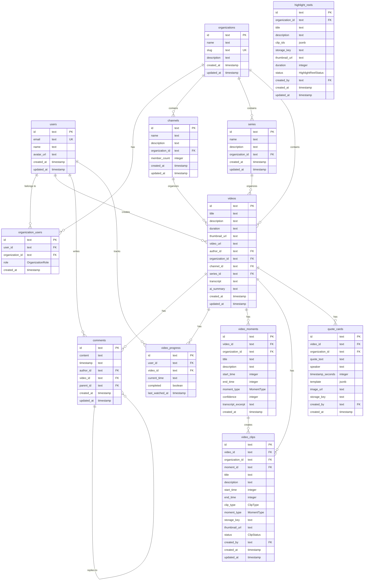

# Database Architecture

Nuclom uses PostgreSQL with Drizzle ORM for type-safe database operations. The schema is designed for multi-tenant video collaboration with organization-based organization.

## Schema Organization

The database schema is organized into multiple files in `src/lib/db/schema/`:

```
src/lib/db/schema/
├── index.ts           # Re-exports all schema files
├── enums.ts           # All PostgreSQL enum types (centralized)
├── auth.ts            # Better-auth managed tables (DO NOT EDIT)
├── user-extensions.ts # Application-specific user data (decoupled from auth)
├── relations.ts       # All Drizzle ORM relations
├── videos.ts          # Video and channel tables
├── comments.ts        # Comment and reaction tables
├── notifications.ts   # User notification tables
├── billing.ts         # Subscription and payment tables
├── integrations.ts    # External service integrations
├── knowledge.ts       # Knowledge graph tables
├── ai-insights.ts     # AI-extracted topics and action items
├── analytics.ts       # Video analytics and metrics
├── speakers.ts        # Speaker diarization tables
├── search.ts          # Semantic search tables
├── legal.ts           # Legal compliance tables
├── audit-logs.ts      # Audit logging tables
├── activity.ts        # Activity feed and webhooks
├── clips.ts           # Video clips and highlights
├── sharing.ts         # Video sharing links
└── workflows.ts       # Workflow templates
```

### Working with Better-Auth Tables

The `auth.ts` file contains tables managed by better-auth. **Do not modify these tables directly.**

To update auth schema:
1. Modify better-auth configuration in `src/lib/auth.ts`
2. Run: `pnpm auth:generate`
3. Run: `pnpm db:generate && pnpm db:migrate`

**Decoupling Pattern**: Application-specific user data is stored in `userExtensions` and `userPreferences` tables, not in the `users` table. This makes it easier to update better-auth without migration conflicts.

```typescript
// Good: Store app-specific data in userExtensions
await db.insert(userExtensions).values({
  userId: user.id,
  tosAcceptedAt: new Date(),
  marketingConsent: true,
});

// Bad: Don't add columns to users table
// The users table is managed by better-auth
```

## Database Schema



## Core Tables

### Users Table

Stores user account information and authentication data.

```sql
CREATE TABLE users (
    id TEXT PRIMARY KEY DEFAULT gen_random_uuid(),
    email TEXT UNIQUE NOT NULL,
    name TEXT,
    avatar_url TEXT,
    created_at TIMESTAMP DEFAULT NOW() NOT NULL,
    updated_at TIMESTAMP DEFAULT NOW() NOT NULL
);
```

**Key Features:**

- UUID primary keys for security
- Email uniqueness constraint
- Soft user profiles (name and avatar optional)
- Timestamp tracking for audit trails

### Organizations Table

Represents team organizations for video collaboration.

```sql
CREATE TABLE organizations (
    id TEXT PRIMARY KEY DEFAULT gen_random_uuid(),
    name TEXT NOT NULL,
    slug TEXT UNIQUE NOT NULL,
    description TEXT,
    created_at TIMESTAMP DEFAULT NOW() NOT NULL,
    updated_at TIMESTAMP DEFAULT NOW() NOT NULL
);
```

**Key Features:**

- Human-readable slugs for URL routing
- Unique slug constraint across all organizations
- Optional descriptions for organization context

### Organization Users Table

Junction table managing user-organization relationships with roles.

```sql
CREATE TABLE organization_users (
    id TEXT PRIMARY KEY DEFAULT gen_random_uuid(),
    user_id TEXT NOT NULL REFERENCES users(id) ON DELETE CASCADE,
    organization_id TEXT NOT NULL REFERENCES organizations(id) ON DELETE CASCADE,
    role OrganizationRole DEFAULT 'MEMBER' NOT NULL,
    created_at TIMESTAMP DEFAULT NOW() NOT NULL,
    UNIQUE(user_id, organization_id)
);

CREATE TYPE OrganizationRole AS ENUM ('OWNER', 'ADMIN', 'MEMBER');
```

**Key Features:**

- Many-to-many relationship between users and organizations
- Role-based access control with enum constraint
- Unique constraint prevents duplicate memberships
- Cascade deletion for data consistency

### Videos Table

Central table for video content and metadata.

```sql
CREATE TABLE videos (
    id TEXT PRIMARY KEY DEFAULT gen_random_uuid(),
    title TEXT NOT NULL,
    description TEXT,
    duration TEXT NOT NULL,
    thumbnail_url TEXT,
    video_url TEXT,
    author_id TEXT REFERENCES users(id),
    organization_id TEXT NOT NULL REFERENCES organizations(id) ON DELETE CASCADE,
    channel_id TEXT REFERENCES channels(id),
    collection_id TEXT REFERENCES collections(id),
    transcript TEXT,
    transcript_segments JSONB,
    processing_status ProcessingStatus DEFAULT 'pending' NOT NULL,
    processing_error TEXT,
    ai_summary TEXT,
    ai_tags JSONB,
    ai_action_items JSONB,
    search_vector TSVECTOR,
    deleted_at TIMESTAMP,
    retention_until TIMESTAMP,
    created_at TIMESTAMP DEFAULT NOW() NOT NULL,
    updated_at TIMESTAMP DEFAULT NOW() NOT NULL
);
```

**Key Features:**

- Flexible organization through channels and collections
- AI-generated content (transcript, summary)
- Author attribution and organization isolation
- Optional categorization (channel/collection can be null)

### Comments Table

Hierarchical comment system for video discussions.

```sql
CREATE TABLE comments (
    id TEXT PRIMARY KEY DEFAULT gen_random_uuid(),
    content TEXT NOT NULL,
    timestamp TEXT, -- Video timestamp for context
    author_id TEXT NOT NULL REFERENCES users(id) ON DELETE CASCADE,
    video_id TEXT NOT NULL REFERENCES videos(id) ON DELETE CASCADE,
    parent_id TEXT REFERENCES comments(id), -- Self-referencing for replies
    created_at TIMESTAMP DEFAULT NOW() NOT NULL,
    updated_at TIMESTAMP DEFAULT NOW() NOT NULL
);
```

**Key Features:**

- Threaded comments with parent-child relationships
- Video timestamp association for contextual comments
- Cascade deletion maintains data integrity
- Self-referencing foreign key for reply threads

### Video Progress Table

Tracks user viewing progress and completion status.

```sql
CREATE TABLE video_progress (
    id TEXT PRIMARY KEY DEFAULT gen_random_uuid(),
    user_id TEXT NOT NULL REFERENCES users(id) ON DELETE CASCADE,
    video_id TEXT NOT NULL REFERENCES videos(id) ON DELETE CASCADE,
    current_time TEXT NOT NULL,
    completed BOOLEAN DEFAULT FALSE NOT NULL,
    last_watched_at TIMESTAMP DEFAULT NOW() NOT NULL,
    UNIQUE(user_id, video_id)
);
```

**Key Features:**

- Per-user progress tracking
- Completion status for analytics
- Last watched timestamp for recommendations
- Unique constraint prevents duplicate progress records

## Database Relationships

### User-Organization Relationships

- **Many-to-Many**: Users can belong to multiple organizations
- **Role-Based**: Each membership has an assigned role
- **Hierarchical**: OWNER > ADMIN > MEMBER permissions

### Content Organization

- **Organization Isolation**: All content belongs to a organization
- **Flexible Categorization**: Videos can be in channels, series, or uncategorized
- **Author Attribution**: Videos are linked to their creators

### Engagement Tracking

- **Comment Threads**: Hierarchical discussion structure
- **Progress Tracking**: Individual viewing progress per user
- **Timestamped Comments**: Comments linked to specific video moments

## Data Types and Constraints

### Primary Keys

- **UUID**: All tables use UUID primary keys for security
- **Generation**: `gen_random_uuid()` for automatic generation
- **Indexing**: Primary keys are automatically indexed

### Foreign Keys

- **Cascade Deletion**: Maintains referential integrity
- **Organization Isolation**: Prevents cross-organization data access
- **User Attribution**: Links content to creators

### Enums

- **OrganizationRole**: Enforces valid role assignments
- **Database Level**: Enum constraints at the database level
- **Type Safety**: Drizzle ORM provides TypeScript enum types

## Indexing Strategy

### Primary Indexes

- All primary keys (UUID) are automatically indexed
- Foreign key columns are indexed for join performance

### Performance Indexes

```sql
-- Video queries by organization
CREATE INDEX idx_videos_organization_id ON videos(organization_id);

-- Comment queries by video
CREATE INDEX idx_comments_video_id ON comments(video_id);

-- Progress queries by user
CREATE INDEX idx_video_progress_user_id ON video_progress(user_id);

-- Organization member queries
CREATE INDEX idx_organization_users_organization_id ON organization_users(organization_id);
```

### Composite Indexes

```sql
-- Video filtering by organization and channel
CREATE INDEX idx_videos_organization_channel ON videos(organization_id, channel_id);

-- Comments with threading
CREATE INDEX idx_comments_video_parent ON comments(video_id, parent_id);
```

## Security Considerations

### Row-Level Security

- **Organization Isolation**: Users can only access their organization content
- **Role-Based Access**: Different permissions based on organization role
- **Data Isolation**: Prevents cross-tenant data access

### Data Validation

- **NOT NULL Constraints**: Required fields are enforced
- **Unique Constraints**: Prevent duplicate records
- **Foreign Key Constraints**: Maintain referential integrity

### Authentication Integration

- **Better-Auth Tables**: Authentication tables managed by Better-Auth
- **Session Management**: Secure session handling
- **OAuth Integration**: External provider authentication

## Migration Strategy

### Development Migrations

```bash
# Generate migration files
pnpm db:generate

# Apply migrations to database
pnpm db:migrate

# Push schema changes (development)
pnpm db:push
```

### Production Migrations

```bash
# Run migrations in production
NODE_ENV=production pnpm db:migrate
```

### Schema Changes

- **Backward Compatibility**: Migrations maintain backward compatibility
- **Rollback Strategy**: Database backups before major schema changes
- **Testing**: Migration testing in staging environment

## Performance Optimization

### Query Optimization

- **Selective Queries**: Only fetch required columns
- **Join Optimization**: Efficient join strategies
- **Pagination**: Limit result sets for large datasets

### Connection Pooling

- **PostgreSQL**: Connection pooling for scalability
- **Drizzle**: Efficient connection management
- **Resource Limits**: Prevent connection exhaustion

### Data Archiving

- **Soft Deletion**: Mark records as deleted instead of removing
- **Archive Strategy**: Move old data to archive tables
- **Retention Policy**: Automated cleanup of old data

## Monitoring and Maintenance

### Database Monitoring

- **Query Performance**: Slow query monitoring
- **Connection Metrics**: Pool utilization tracking
- **Storage Utilization**: Database size monitoring

### Backup Strategy

- **Automated Backups**: Regular database snapshots
- **Point-in-Time Recovery**: Transaction log backups
- **Disaster Recovery**: Cross-region backup replication

### Health Checks

- **Connection Health**: Database connectivity monitoring
- **Query Health**: Performance threshold monitoring
- **Storage Health**: Disk space and I/O monitoring

## Decision Registry Tables

The Decision Registry tracks team decisions extracted from meetings or manually added.

### Decisions Table

Stores decision records with context and metadata.

```sql
CREATE TABLE decisions (
    id TEXT PRIMARY KEY DEFAULT gen_random_uuid(),
    organization_id TEXT NOT NULL REFERENCES organizations(id) ON DELETE CASCADE,
    summary TEXT NOT NULL,
    context TEXT,
    source TEXT NOT NULL, -- 'meeting' | 'adhoc' | 'manual'
    video_id TEXT REFERENCES videos(id),
    video_timestamp INTEGER,
    status TEXT NOT NULL DEFAULT 'decided', -- 'decided' | 'proposed' | 'superseded'
    decided_at TIMESTAMP DEFAULT NOW() NOT NULL,
    created_by_id TEXT REFERENCES users(id),
    superseded_by_id TEXT REFERENCES decisions(id),
    search_vector TSVECTOR,
    created_at TIMESTAMP DEFAULT NOW() NOT NULL,
    updated_at TIMESTAMP DEFAULT NOW() NOT NULL
);
```

**Key Features:**

- Full-text search via `search_vector`
- Video timestamp linking for context
- Supersession tracking for decision evolution
- Source tracking (meeting vs manual)

### Decision Participants

Links users to decisions they participated in.

```sql
CREATE TABLE decision_participants (
    id TEXT PRIMARY KEY DEFAULT gen_random_uuid(),
    decision_id TEXT NOT NULL REFERENCES decisions(id) ON DELETE CASCADE,
    user_id TEXT NOT NULL REFERENCES users(id) ON DELETE CASCADE,
    created_at TIMESTAMP DEFAULT NOW() NOT NULL,
    UNIQUE(decision_id, user_id)
);
```

### Decision Tags

Organization-scoped tags for categorizing decisions.

```sql
CREATE TABLE decision_tags (
    id TEXT PRIMARY KEY DEFAULT gen_random_uuid(),
    organization_id TEXT NOT NULL REFERENCES organizations(id) ON DELETE CASCADE,
    name TEXT NOT NULL,
    color TEXT,
    created_at TIMESTAMP DEFAULT NOW() NOT NULL,
    UNIQUE(organization_id, name)
);
```

### Decision Tag Assignments

Many-to-many relationship between decisions and tags.

```sql
CREATE TABLE decision_tag_assignments (
    id TEXT PRIMARY KEY DEFAULT gen_random_uuid(),
    decision_id TEXT NOT NULL REFERENCES decisions(id) ON DELETE CASCADE,
    tag_id TEXT NOT NULL REFERENCES decision_tags(id) ON DELETE CASCADE,
    created_at TIMESTAMP DEFAULT NOW() NOT NULL,
    UNIQUE(decision_id, tag_id)
);
```

### Decision Links

Links between related decisions.

```sql
CREATE TABLE decision_links (
    id TEXT PRIMARY KEY DEFAULT gen_random_uuid(),
    decision_id TEXT NOT NULL REFERENCES decisions(id) ON DELETE CASCADE,
    target_decision_id TEXT NOT NULL REFERENCES decisions(id) ON DELETE CASCADE,
    link_type TEXT NOT NULL DEFAULT 'related', -- 'related' | 'supersedes' | 'depends_on'
    created_at TIMESTAMP DEFAULT NOW() NOT NULL,
    UNIQUE(decision_id, target_decision_id)
);
```

### Decision Subscriptions

User subscriptions to decision topics for notifications.

```sql
CREATE TABLE decision_subscriptions (
    id TEXT PRIMARY KEY DEFAULT gen_random_uuid(),
    user_id TEXT NOT NULL REFERENCES users(id) ON DELETE CASCADE,
    tag_id TEXT NOT NULL REFERENCES decision_tags(id) ON DELETE CASCADE,
    frequency TEXT NOT NULL DEFAULT 'instant', -- 'instant' | 'daily' | 'weekly'
    created_at TIMESTAMP DEFAULT NOW() NOT NULL,
    UNIQUE(user_id, tag_id)
);
```

### Decision Edits

Audit trail for decision modifications.

```sql
CREATE TABLE decision_edits (
    id TEXT PRIMARY KEY DEFAULT gen_random_uuid(),
    decision_id TEXT NOT NULL REFERENCES decisions(id) ON DELETE CASCADE,
    user_id TEXT NOT NULL REFERENCES users(id) ON DELETE CASCADE,
    field_changed TEXT NOT NULL,
    old_value TEXT,
    new_value TEXT,
    edited_at TIMESTAMP DEFAULT NOW() NOT NULL
);
```

## AI Insights Tables

### AI Topics

Aggregated topic tracking for organization-wide trend analysis.

```sql
CREATE TABLE ai_topics (
    id TEXT PRIMARY KEY DEFAULT gen_random_uuid(),
    organization_id TEXT NOT NULL REFERENCES organizations(id) ON DELETE CASCADE,
    name TEXT NOT NULL,
    normalized_name TEXT NOT NULL, -- lowercase for deduplication
    description TEXT,
    mention_count INTEGER NOT NULL DEFAULT 1,
    video_count INTEGER NOT NULL DEFAULT 1,
    last_mentioned_at TIMESTAMP DEFAULT NOW() NOT NULL,
    first_mentioned_at TIMESTAMP DEFAULT NOW() NOT NULL,
    trend "TopicTrend" NOT NULL DEFAULT 'stable', -- 'rising' | 'stable' | 'declining'
    trend_score INTEGER DEFAULT 0, -- -100 to 100
    keywords JSONB DEFAULT '[]',
    metadata JSONB,
    created_at TIMESTAMP DEFAULT NOW() NOT NULL,
    updated_at TIMESTAMP DEFAULT NOW() NOT NULL,
    UNIQUE(organization_id, normalized_name)
);
CREATE INDEX ai_topics_org_idx ON ai_topics(organization_id);
CREATE INDEX ai_topics_trend_idx ON ai_topics(organization_id, trend);
```

### AI Action Items

Organization-wide action items extracted from videos with completion tracking.

```sql
CREATE TABLE ai_action_items (
    id TEXT PRIMARY KEY DEFAULT gen_random_uuid(),
    organization_id TEXT NOT NULL REFERENCES organizations(id) ON DELETE CASCADE,
    video_id TEXT NOT NULL REFERENCES videos(id) ON DELETE CASCADE,
    title TEXT NOT NULL,
    description TEXT,
    assignee TEXT, -- speaker name or mention
    assignee_user_id TEXT REFERENCES users(id) ON DELETE SET NULL,
    status "ActionItemStatus" NOT NULL DEFAULT 'pending', -- 'pending' | 'in_progress' | 'completed' | 'cancelled'
    priority "ActionItemPriority" NOT NULL DEFAULT 'medium', -- 'high' | 'medium' | 'low'
    due_date TIMESTAMP,
    completed_at TIMESTAMP,
    completed_by_id TEXT REFERENCES users(id) ON DELETE SET NULL,
    timestamp_start INTEGER, -- seconds into video
    timestamp_end INTEGER,
    confidence INTEGER, -- 0-100
    extracted_from TEXT, -- transcript snippet
    created_at TIMESTAMP DEFAULT NOW() NOT NULL,
    updated_at TIMESTAMP DEFAULT NOW() NOT NULL
);
CREATE INDEX ai_action_items_org_idx ON ai_action_items(organization_id, status);
CREATE INDEX ai_action_items_video_idx ON ai_action_items(video_id);
CREATE INDEX ai_action_items_status_idx ON ai_action_items(status, priority);
```

## Semantic Search Tables

Semantic search enables finding content by meaning rather than exact keywords. See [semantic-search.md](./semantic-search.md) for full documentation.

### transcript_chunks Table

Stores chunked transcript segments with vector embeddings for semantic search.

```sql
CREATE TABLE transcript_chunks (
    id UUID PRIMARY KEY DEFAULT gen_random_uuid(),
    video_id TEXT NOT NULL REFERENCES videos(id) ON DELETE CASCADE,
    organization_id TEXT NOT NULL REFERENCES organizations(id) ON DELETE CASCADE,
    chunk_index INTEGER NOT NULL,
    text TEXT NOT NULL,
    token_count INTEGER,
    timestamp_start INTEGER,  -- seconds into video
    timestamp_end INTEGER,
    speakers TEXT[],
    embedding vector(1536),   -- OpenAI text-embedding-3-small
    created_at TIMESTAMP DEFAULT NOW() NOT NULL,
    UNIQUE(video_id, chunk_index)
);

-- HNSW index for fast similarity search
CREATE INDEX transcript_chunks_embedding_idx
    ON transcript_chunks
    USING hnsw (embedding vector_cosine_ops)
    WITH (m = 16, ef_construction = 64);
```

**Key Features:**

- Vector embeddings for semantic similarity search
- Timestamp mapping for video context
- HNSW index for sub-linear search time
- Organization isolation for multi-tenancy

### pgvector Extension

The semantic search functionality uses PostgreSQL's pgvector extension:

```sql
-- Enable vector extension
CREATE EXTENSION IF NOT EXISTS vector;
```

### Embedding Columns

Additional embedding columns exist on related tables:

- `decisions.embedding_vector vector(1536)` - Semantic search for decisions
- `knowledge_nodes.embedding_vector vector(1536)` - Knowledge graph semantic search


## Future Enhancements

### Scaling Considerations

- **Read Replicas**: Distribute read load
- **Sharding**: Horizontal scaling for large datasets
- **Caching**: Redis for frequently accessed data

### Advanced Features

- **Full-Text Search**: PostgreSQL full-text search
- **Semantic Search**: Vector-based similarity search with pgvector
- **Hybrid Search**: Combined keyword and semantic ranking
- **JSON Columns**: Flexible metadata storage
- **Triggers**: Automated data processing
- **Views**: Simplified query interfaces
