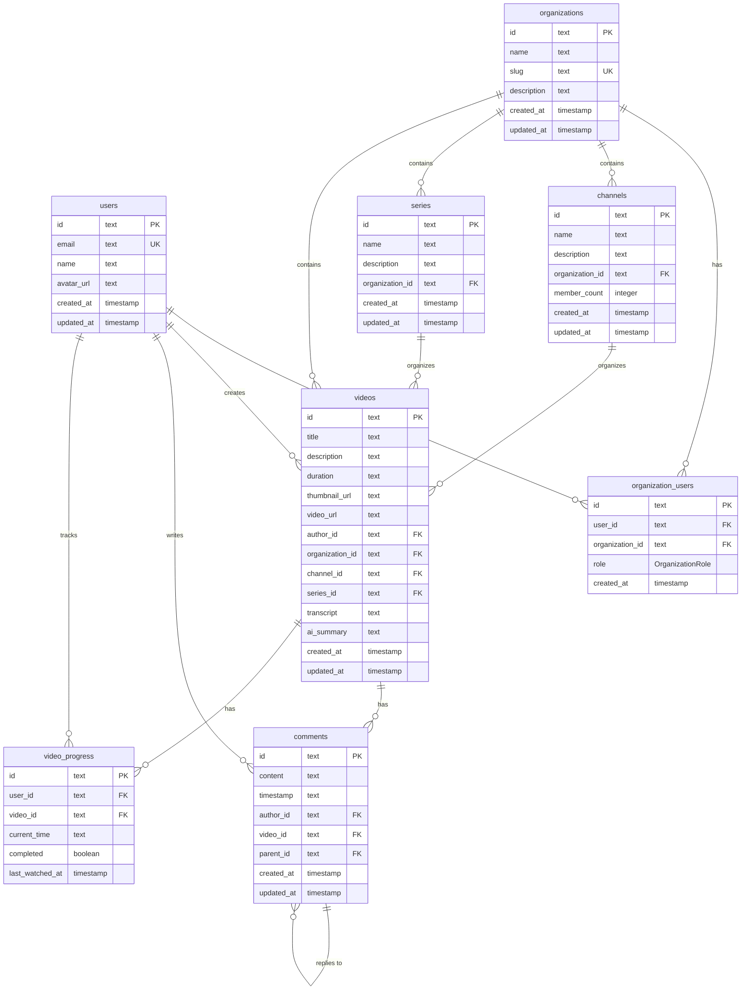

# Database Architecture

Nuclom uses PostgreSQL with Drizzle ORM for type-safe database operations. The schema is designed for multi-tenant video collaboration with organization-based organization.

## Database Schema



## Core Tables

### Users Table

Stores user account information and authentication data.

```sql
CREATE TABLE users (
    id TEXT PRIMARY KEY DEFAULT gen_random_uuid(),
    email TEXT UNIQUE NOT NULL,
    name TEXT,
    avatar_url TEXT,
    created_at TIMESTAMP DEFAULT NOW() NOT NULL,
    updated_at TIMESTAMP DEFAULT NOW() NOT NULL
);
```

**Key Features:**

- UUID primary keys for security
- Email uniqueness constraint
- Soft user profiles (name and avatar optional)
- Timestamp tracking for audit trails

### Organizations Table

Represents team organizations for video collaboration.

```sql
CREATE TABLE organizations (
    id TEXT PRIMARY KEY DEFAULT gen_random_uuid(),
    name TEXT NOT NULL,
    slug TEXT UNIQUE NOT NULL,
    description TEXT,
    created_at TIMESTAMP DEFAULT NOW() NOT NULL,
    updated_at TIMESTAMP DEFAULT NOW() NOT NULL
);
```

**Key Features:**

- Human-readable slugs for URL routing
- Unique slug constraint across all organizations
- Optional descriptions for organization context

### Organization Users Table

Junction table managing user-organization relationships with roles.

```sql
CREATE TABLE organization_users (
    id TEXT PRIMARY KEY DEFAULT gen_random_uuid(),
    user_id TEXT NOT NULL REFERENCES users(id) ON DELETE CASCADE,
    organization_id TEXT NOT NULL REFERENCES organizations(id) ON DELETE CASCADE,
    role OrganizationRole DEFAULT 'MEMBER' NOT NULL,
    created_at TIMESTAMP DEFAULT NOW() NOT NULL,
    UNIQUE(user_id, organization_id)
);

CREATE TYPE OrganizationRole AS ENUM ('OWNER', 'ADMIN', 'MEMBER');
```

**Key Features:**

- Many-to-many relationship between users and organizations
- Role-based access control with enum constraint
- Unique constraint prevents duplicate memberships
- Cascade deletion for data consistency

### Videos Table

Central table for video content and metadata.

```sql
CREATE TABLE videos (
    id TEXT PRIMARY KEY DEFAULT gen_random_uuid(),
    title TEXT NOT NULL,
    description TEXT,
    duration TEXT NOT NULL,
    thumbnail_url TEXT,
    video_url TEXT,
    author_id TEXT NOT NULL REFERENCES users(id),
    organization_id TEXT NOT NULL REFERENCES organizations(id) ON DELETE CASCADE,
    channel_id TEXT REFERENCES channels(id),
    series_id TEXT REFERENCES series(id),
    transcript TEXT,
    ai_summary TEXT,
    created_at TIMESTAMP DEFAULT NOW() NOT NULL,
    updated_at TIMESTAMP DEFAULT NOW() NOT NULL
);
```

**Key Features:**

- Flexible organization through channels and series
- AI-generated content (transcript, summary)
- Author attribution and organization isolation
- Optional categorization (channel/series can be null)

### Comments Table

Hierarchical comment system for video discussions.

```sql
CREATE TABLE comments (
    id TEXT PRIMARY KEY DEFAULT gen_random_uuid(),
    content TEXT NOT NULL,
    timestamp TEXT, -- Video timestamp for context
    author_id TEXT NOT NULL REFERENCES users(id) ON DELETE CASCADE,
    video_id TEXT NOT NULL REFERENCES videos(id) ON DELETE CASCADE,
    parent_id TEXT REFERENCES comments(id), -- Self-referencing for replies
    created_at TIMESTAMP DEFAULT NOW() NOT NULL,
    updated_at TIMESTAMP DEFAULT NOW() NOT NULL
);
```

**Key Features:**

- Threaded comments with parent-child relationships
- Video timestamp association for contextual comments
- Cascade deletion maintains data integrity
- Self-referencing foreign key for reply threads

### Video Progress Table

Tracks user viewing progress and completion status.

```sql
CREATE TABLE video_progress (
    id TEXT PRIMARY KEY DEFAULT gen_random_uuid(),
    user_id TEXT NOT NULL REFERENCES users(id) ON DELETE CASCADE,
    video_id TEXT NOT NULL REFERENCES videos(id) ON DELETE CASCADE,
    current_time TEXT NOT NULL,
    completed BOOLEAN DEFAULT FALSE NOT NULL,
    last_watched_at TIMESTAMP DEFAULT NOW() NOT NULL,
    UNIQUE(user_id, video_id)
);
```

**Key Features:**

- Per-user progress tracking
- Completion status for analytics
- Last watched timestamp for recommendations
- Unique constraint prevents duplicate progress records

## Database Relationships

### User-Organization Relationships

- **Many-to-Many**: Users can belong to multiple organizations
- **Role-Based**: Each membership has an assigned role
- **Hierarchical**: OWNER > ADMIN > MEMBER permissions

### Content Organization

- **Organization Isolation**: All content belongs to a organization
- **Flexible Categorization**: Videos can be in channels, series, or uncategorized
- **Author Attribution**: Videos are linked to their creators

### Engagement Tracking

- **Comment Threads**: Hierarchical discussion structure
- **Progress Tracking**: Individual viewing progress per user
- **Timestamped Comments**: Comments linked to specific video moments

## Data Types and Constraints

### Primary Keys

- **UUID**: All tables use UUID primary keys for security
- **Generation**: `gen_random_uuid()` for automatic generation
- **Indexing**: Primary keys are automatically indexed

### Foreign Keys

- **Cascade Deletion**: Maintains referential integrity
- **Organization Isolation**: Prevents cross-organization data access
- **User Attribution**: Links content to creators

### Enums

- **OrganizationRole**: Enforces valid role assignments
- **Database Level**: Enum constraints at the database level
- **Type Safety**: Drizzle ORM provides TypeScript enum types

## Indexing Strategy

### Primary Indexes

- All primary keys (UUID) are automatically indexed
- Foreign key columns are indexed for join performance

### Performance Indexes

```sql
-- Video queries by organization
CREATE INDEX idx_videos_organization_id ON videos(organization_id);

-- Comment queries by video
CREATE INDEX idx_comments_video_id ON comments(video_id);

-- Progress queries by user
CREATE INDEX idx_video_progress_user_id ON video_progress(user_id);

-- Organization member queries
CREATE INDEX idx_organization_users_organization_id ON organization_users(organization_id);
```

### Composite Indexes

```sql
-- Video filtering by organization and channel
CREATE INDEX idx_videos_organization_channel ON videos(organization_id, channel_id);

-- Comments with threading
CREATE INDEX idx_comments_video_parent ON comments(video_id, parent_id);
```

## Security Considerations

### Row-Level Security

- **Organization Isolation**: Users can only access their organization content
- **Role-Based Access**: Different permissions based on organization role
- **Data Isolation**: Prevents cross-tenant data access

### Data Validation

- **NOT NULL Constraints**: Required fields are enforced
- **Unique Constraints**: Prevent duplicate records
- **Foreign Key Constraints**: Maintain referential integrity

### Authentication Integration

- **Better-Auth Tables**: Authentication tables managed by Better-Auth
- **Session Management**: Secure session handling
- **OAuth Integration**: External provider authentication

## Migration Strategy

### Development Migrations

```bash
# Generate migration files
pnpm db:generate

# Apply migrations to database
pnpm db:migrate

# Push schema changes (development)
pnpm db:push
```

### Production Migrations

```bash
# Run migrations in production
NODE_ENV=production pnpm db:migrate
```

### Schema Changes

- **Backward Compatibility**: Migrations maintain backward compatibility
- **Rollback Strategy**: Database backups before major schema changes
- **Testing**: Migration testing in staging environment

## Performance Optimization

### Query Optimization

- **Selective Queries**: Only fetch required columns
- **Join Optimization**: Efficient join strategies
- **Pagination**: Limit result sets for large datasets

### Connection Pooling

- **PostgreSQL**: Connection pooling for scalability
- **Drizzle**: Efficient connection management
- **Resource Limits**: Prevent connection exhaustion

### Data Archiving

- **Soft Deletion**: Mark records as deleted instead of removing
- **Archive Strategy**: Move old data to archive tables
- **Retention Policy**: Automated cleanup of old data

## Monitoring and Maintenance

### Database Monitoring

- **Query Performance**: Slow query monitoring
- **Connection Metrics**: Pool utilization tracking
- **Storage Utilization**: Database size monitoring

### Backup Strategy

- **Automated Backups**: Regular database snapshots
- **Point-in-Time Recovery**: Transaction log backups
- **Disaster Recovery**: Cross-region backup replication

### Health Checks

- **Connection Health**: Database connectivity monitoring
- **Query Health**: Performance threshold monitoring
- **Storage Health**: Disk space and I/O monitoring

## Future Enhancements

### Scaling Considerations

- **Read Replicas**: Distribute read load
- **Sharding**: Horizontal scaling for large datasets
- **Caching**: Redis for frequently accessed data

### Advanced Features

- **Full-Text Search**: PostgreSQL full-text search
- **JSON Columns**: Flexible metadata storage
- **Triggers**: Automated data processing
- **Views**: Simplified query interfaces
