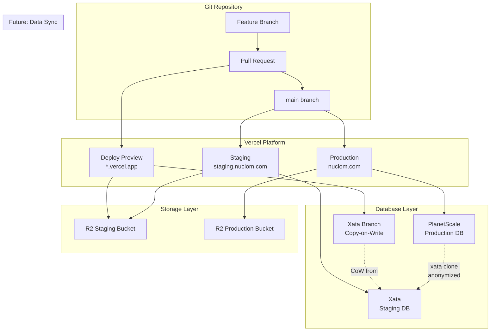
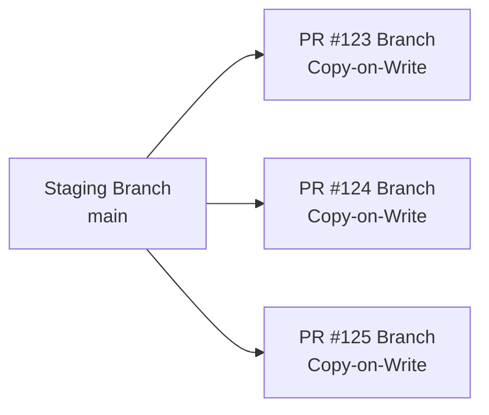
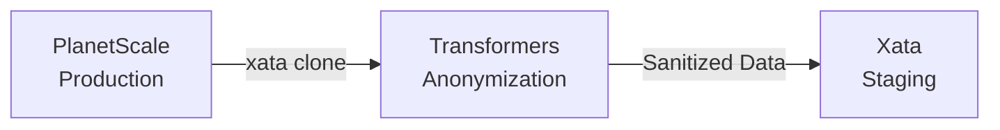
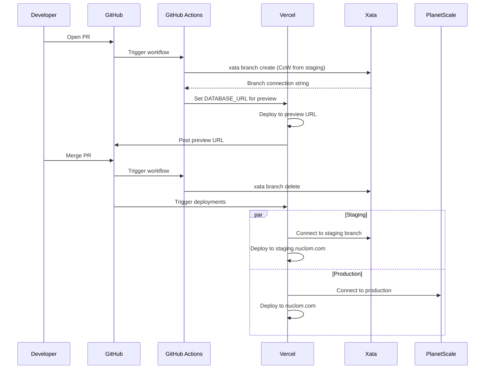

# Deployment Environments

This document outlines Nuclom's deployment strategy across Production, Staging, and Deploy Preview environments.

## Environment Overview

| Aspect | Deploy Preview | Staging | Production |
|--------|----------------|---------|------------|
| **Purpose** | PR validation | Pre-release testing, QA | Live user traffic |
| **URL** | `*.vercel.app` (per-PR) | `staging.nuclom.com` | `nuclom.com` |
| **Trigger** | PR opened/updated | Merge to `main` | Merge to `main` |
| **Database** | Xata (CoW from Staging) | Xata | PlanetScale |
| **Storage** | Shared staging R2 bucket | Staging R2 bucket | Production R2 bucket |
| **Data** | Copy of staging data | Synthetic test data (future: anonymized CDC) | Real user data |

## Architecture



## Database Strategy

### Production: PlanetScale

PlanetScale provides the production PostgreSQL database with:
- **Non-blocking schema changes** for zero-downtime migrations
- **Automatic backups** with point-in-time recovery
- **Read replicas** for scaling read-heavy workloads

```bash
# Production connection (via Vercel integration)
DATABASE_URL="postgresql://...@aws.connect.psdb.cloud/nuclom?sslmode=require"
```

### Staging: Xata

Xata provides the staging database with:
- **Branching support** for deploy previews
- **PostgreSQL compatibility** via their wire protocol
- **Built-in search** and analytics capabilities

```bash
# Staging connection
DATABASE_URL="postgresql://...@us-east-1.sql.xata.sh/nuclom:main?sslmode=require"
```

### Deploy Preview: Xata Copy-on-Write Branches

Xata uses **Copy-on-Write (CoW) at the storage layer** to enable instant branching. When a branch is created, it inherits the parent's schema and data at that moment, with both functioning as independent PostgreSQL instances afterward.

Each deploy preview gets an isolated database branch that:
- **Inherits data instantly** - CoW creates a metadata index pointing to original data blocks (no copying)
- **Lazy copying** - Only when either branch modifies a block does that block get copied
- **Full isolation** - Modifications in a child branch never affect the parent, and vice versa



Branch management via Xata CLI:

```bash
# Create a branch from staging
xata branch create --name "pr-123" --parent-branch "staging"

# List branches
xata branch list

# Delete branch when PR closes
xata branch delete --name "pr-123"
```

For CI/CD automation, branches are created in GitHub Actions when a PR is opened and deleted on merge/close.

## Storage Strategy

### Separate R2 Buckets

We maintain separate R2 buckets per environment:

| Bucket | Environment | Purpose |
|--------|-------------|---------|
| `nuclom-production` | Production | Real user videos and assets |
| `nuclom-staging` | Staging + Deploy Preview | Test videos and assets |

**Why separate buckets?**
1. **Data isolation** - Production assets never accessible from non-prod
2. **Safe testing** - Can freely modify/delete staging assets
3. **Access control** - Different credentials per environment
4. **Cost visibility** - Clear billing separation

Deploy previews share the staging bucket since:
- Preview environments are short-lived
- Test data is already synthetic
- Simplifies configuration

### Bucket Configuration

```bash
# Production bucket
R2_BUCKET_NAME=nuclom-production
R2_PUBLIC_URL=https://assets.nuclom.com

# Staging bucket (also used by deploy previews)
R2_BUCKET_NAME=nuclom-staging
R2_PUBLIC_URL=https://staging-assets.nuclom.com
```

## Future: Anonymized Data Sync to Staging

We plan to use Xata's `xata clone` to copy and anonymize production data to staging:



### How xata clone Works

`xata clone` copies data between PostgreSQL instances while anonymizing on-the-fly. This runs on a periodic schedule (e.g., nightly) to keep staging fresh with realistic yet secure data.

```bash
# Configure transformers (interactive prompt for column selection)
xata clone config --source-url $PRODUCTION_DATABASE_URL --mode prompt

# Execute the clone with anonymization
xata clone start --source-url $PRODUCTION_DATABASE_URL
```

### Transformer System

Xata uses **transformers** - column-level tools that handle anonymization:

| Transformer | Example |
|-------------|---------|
| **Deterministic** | `info@xata.io` → `a2asd112@example.com` (same input = same output) |
| **Masking** | `info@xata.io` → `i***o@xata.io` |
| **Templating** | Conditional logic and composed values |

Supported data types: emails, names, addresses, phone numbers, IP addresses.

**Deterministic transformation** preserves referential integrity - the same email always maps to the same fake email, so foreign key relationships remain valid.

### Why Anonymized Production Data?

- **Realistic data** - Test against production-like data volumes and patterns
- **Edge cases** - Discover bugs that only appear with real-world data
- **Performance testing** - Validate queries against realistic cardinality

### Storage with Data Sync

Even with production data flowing to staging, we keep storage separate:
- **Videos won't be synced** - Too large and contains user content
- **Staging uses synthetic test videos** - Small curated set for testing
- **Thumbnails regenerated** - From test videos, not production

## Environment Variables

### Production (Vercel Production Environment)

```bash
# Database
DATABASE_URL=postgresql://...@aws.connect.psdb.cloud/nuclom?sslmode=require

# Storage
R2_BUCKET_NAME=nuclom-production
R2_PUBLIC_URL=https://assets.nuclom.com

# Auth (production OAuth apps)
BETTER_AUTH_URL=https://nuclom.com
```

### Staging (Vercel Preview Environment - main branch)

```bash
# Database
DATABASE_URL=postgresql://...@us-east-1.sql.xata.sh/nuclom:main?sslmode=require

# Storage (shared with deploy previews)
R2_BUCKET_NAME=nuclom-staging
R2_PUBLIC_URL=https://staging-assets.nuclom.com

# Auth (staging OAuth apps)
BETTER_AUTH_URL=https://staging.nuclom.com
```

### Deploy Preview (Vercel Preview Environment - PR branches)

```bash
# Database (auto-provisioned Xata branch)
DATABASE_URL=postgresql://...@us-east-1.sql.xata.sh/nuclom:pr-123?sslmode=require

# Storage (shared with staging)
R2_BUCKET_NAME=nuclom-staging
R2_PUBLIC_URL=https://staging-assets.nuclom.com

# Auth (staging OAuth apps - callback URLs must include Vercel preview domains)
BETTER_AUTH_URL=${VERCEL_URL}
```

## Deployment Flow



## Database Migrations

### Migration Strategy

| Environment | Database | Migration Approach |
|-------------|----------|-------------------|
| Production | PlanetScale (PostgreSQL) | Deploy requests (non-blocking) |
| Staging | Xata (PostgreSQL) | Direct migration |
| Deploy Preview | Xata branch (PostgreSQL) | Inherits from staging |

### Running Migrations

```bash
# 1. Generate migration from schema changes
pnpm db:generate

# 2. Apply to staging first
DATABASE_URL="$STAGING_DATABASE_URL" pnpm db:migrate

# 3. For production, use PlanetScale deploy requests
#    - Create deploy request in PlanetScale dashboard
#    - Review schema diff
#    - Deploy (non-blocking, no downtime)
```

### Schema Compatibility

All environments use PostgreSQL, simplifying schema management:
- Same SQL dialect across PlanetScale and Xata
- Migrations tested on staging apply cleanly to production
- No provider-specific workarounds needed

## Rollback Procedures

### Application Rollback

```bash
# Instant rollback via Vercel
vercel rollback [deployment-url]
```

### Database Rollback

**PlanetScale (Production)**:
- Revert deploy request if still pending
- Point-in-time recovery for data issues

**Xata (Staging)**:
- Restore from automatic backups
- Or recreate branch from a known-good state

## Related Documentation

- [Database Schema](./database.md) - Schema design and relations
- [Security](./security.md) - Security considerations
- [Monitoring](./monitoring.md) - Observability setup
