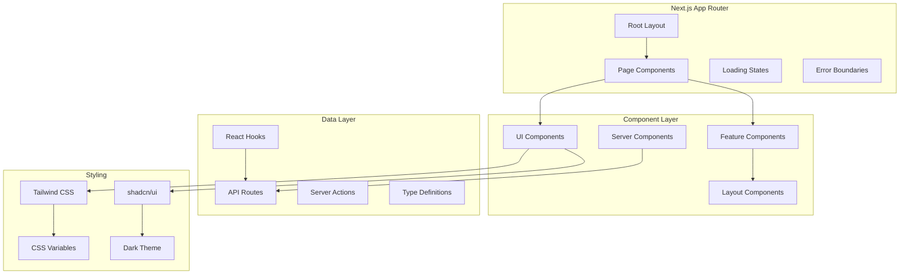
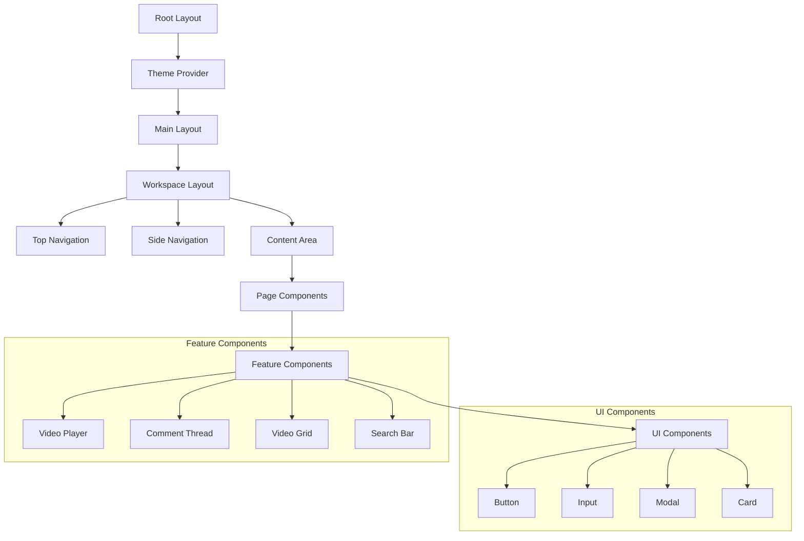

# Frontend Architecture

Nuclom's frontend is built with Next.js 15 App Router, leveraging React 19 Server Components for optimal performance and developer experience.

## Architecture Overview



## Directory Structure

```
src/
├── app/                    # Next.js App Router
│   ├── (main)/            # Route groups
│   │   └── [workspace]/   # Dynamic workspace routes
│   ├── api/               # API routes
│   ├── globals.css        # Global styles
│   └── layout.tsx         # Root layout
├── components/            # React components
│   ├── ui/               # shadcn/ui components
│   ├── feature/          # Feature-specific components
│   └── layout/           # Layout components
├── hooks/                # Custom React hooks
├── lib/                  # Utility libraries
│   ├── api.ts           # API client
│   ├── auth.ts          # Authentication
│   ├── db/              # Database schema
│   └── utils.ts         # Utility functions
└── types/               # TypeScript type definitions
```

## Routing Architecture

### App Router Structure
```
app/
├── page.tsx                    # Home page
├── layout.tsx                  # Root layout
├── (main)/                     # Route group for authenticated pages
│   └── [workspace]/           # Dynamic workspace routing
│       ├── layout.tsx         # Workspace layout
│       ├── page.tsx           # Workspace dashboard
│       ├── videos/
│       │   ├── page.tsx       # Video list
│       │   └── [id]/
│       │       └── page.tsx   # Video detail
│       ├── channels/
│       │   ├── page.tsx       # Channel list
│       │   └── [id]/
│       │       └── page.tsx   # Channel detail
│       ├── series/
│       │   ├── page.tsx       # Series list
│       │   └── [id]/
│       │       └── page.tsx   # Series detail
│       ├── search/
│       │   ├── page.tsx       # Search results
│       │   └── loading.tsx    # Search loading
│       ├── shared/
│       │   └── page.tsx       # Shared content
│       ├── my-videos/
│       │   └── page.tsx       # User's videos
│       └── settings/
│           ├── page.tsx       # General settings
│           ├── members/
│           │   └── page.tsx   # Member management
│           └── integrations/
│               └── page.tsx   # Integration settings
└── api/                       # API routes
    ├── auth/
    │   └── [...better-auth]/
    │       └── route.ts       # Authentication endpoints
    ├── videos/
    │   ├── route.ts           # Video CRUD
    │   └── [id]/
    │       └── route.ts       # Video detail
    ├── workspaces/
    │   └── route.ts           # Workspace operations
    └── ai/
        └── analyze/
            └── route.ts       # AI analysis
```

### Dynamic Routing
- **Workspace-based**: `[workspace]` parameter for multi-tenancy
- **Content-specific**: `[id]` parameters for individual resources
- **Type-safe**: Parameter validation with TypeScript
- **SEO-friendly**: Meaningful URLs with workspace slugs

## Component Architecture

### Component Hierarchy


### Component Types

#### 1. Server Components
```typescript
// Server Component example
export default async function VideoList({ 
  workspaceId 
}: { 
  workspaceId: string 
}) {
  const videos = await getVideos(workspaceId);
  
  return (
    <div className="grid grid-cols-1 md:grid-cols-2 lg:grid-cols-3 gap-6">
      {videos.map((video) => (
        <VideoCard key={video.id} video={video} />
      ))}
    </div>
  );
}
```

#### 2. Client Components
```typescript
'use client';

import { useState } from 'react';
import { useVideo } from '@/hooks/use-api';

export default function VideoPlayer({ 
  videoId 
}: { 
  videoId: string 
}) {
  const [currentTime, setCurrentTime] = useState(0);
  const { data: video, isLoading } = useVideo(videoId);
  
  if (isLoading) return <VideoPlayerSkeleton />;
  
  return (
    <div className="video-player">
      <video 
        src={video.videoUrl}
        onTimeUpdate={(e) => setCurrentTime(e.currentTarget.currentTime)}
      />
      <VideoControls currentTime={currentTime} />
    </div>
  );
}
```

#### 3. UI Components (shadcn/ui)
```typescript
import { Button } from '@/components/ui/button';
import { Input } from '@/components/ui/input';
import { Card, CardContent, CardHeader, CardTitle } from '@/components/ui/card';

export function VideoUploadForm() {
  return (
    <Card>
      <CardHeader>
        <CardTitle>Upload Video</CardTitle>
      </CardHeader>
      <CardContent>
        <form className="space-y-4">
          <Input placeholder="Video title" />
          <Input type="file" accept="video/*" />
          <Button type="submit">Upload</Button>
        </form>
      </CardContent>
    </Card>
  );
}
```

## State Management

### React Hooks Pattern
```typescript
// Custom hook for video data
export function useVideo(videoId: string) {
  const [video, setVideo] = useState<VideoWithDetails | null>(null);
  const [loading, setLoading] = useState(true);
  const [error, setError] = useState<string | null>(null);
  
  useEffect(() => {
    async function fetchVideo() {
      try {
        setLoading(true);
        const data = await videoApi.getVideo(videoId);
        setVideo(data);
      } catch (err) {
        setError(err instanceof Error ? err.message : 'Failed to load video');
      } finally {
        setLoading(false);
      }
    }
    
    fetchVideo();
  }, [videoId]);
  
  return { video, loading, error };
}
```

### Context Providers
```typescript
// Workspace context
export const WorkspaceContext = createContext<{
  currentWorkspace: Workspace | null;
  workspaces: Workspace[];
  switchWorkspace: (workspaceId: string) => void;
} | null>(null);

export function WorkspaceProvider({ children }: { children: React.ReactNode }) {
  const [currentWorkspace, setCurrentWorkspace] = useState<Workspace | null>(null);
  const [workspaces, setWorkspaces] = useState<Workspace[]>([]);
  
  const switchWorkspace = useCallback((workspaceId: string) => {
    const workspace = workspaces.find(w => w.id === workspaceId);
    if (workspace) {
      setCurrentWorkspace(workspace);
    }
  }, [workspaces]);
  
  return (
    <WorkspaceContext.Provider value={{ 
      currentWorkspace, 
      workspaces, 
      switchWorkspace 
    }}>
      {children}
    </WorkspaceContext.Provider>
  );
}
```

## Data Fetching

### API Integration
```typescript
// Type-safe API client
export const videoApi = {
  async getVideos(params: {
    workspaceId?: string;
    channelId?: string;
    seriesId?: string;
    page?: number;
    limit?: number;
  } = {}): Promise<PaginatedResponse<VideoWithAuthor>> {
    const searchParams = new URLSearchParams();
    Object.entries(params).forEach(([key, value]) => {
      if (value !== undefined) {
        searchParams.append(key, value.toString());
      }
    });
    
    return fetchApi(`/videos?${searchParams.toString()}`);
  },
  
  async getVideo(id: string): Promise<VideoWithDetails> {
    return fetchApi(`/videos/${id}`);
  },
  
  async createVideo(data: CreateVideoData): Promise<VideoWithDetails> {
    return fetchApi('/videos', {
      method: 'POST',
      body: JSON.stringify(data),
    });
  },
};
```

### Server Actions
```typescript
// Server action for video creation
export async function createVideo(formData: FormData) {
  const session = await auth();
  if (!session?.user) {
    throw new Error('Unauthorized');
  }
  
  const title = formData.get('title') as string;
  const description = formData.get('description') as string;
  const workspaceId = formData.get('workspaceId') as string;
  
  const video = await db.insert(videos).values({
    title,
    description,
    authorId: session.user.id,
    workspaceId,
    duration: '00:00:00', // Will be updated after processing
  }).returning();
  
  revalidatePath(`/${workspaceId}/videos`);
  return video[0];
}
```

## Styling Architecture

### Tailwind CSS Configuration
```typescript
// tailwind.config.ts
export default {
  darkMode: 'class',
  content: [
    './src/pages/**/*.{js,ts,jsx,tsx,mdx}',
    './src/components/**/*.{js,ts,jsx,tsx,mdx}',
    './src/app/**/*.{js,ts,jsx,tsx,mdx}',
  ],
  theme: {
    extend: {
      colors: {
        border: 'hsl(var(--border))',
        input: 'hsl(var(--input))',
        ring: 'hsl(var(--ring))',
        background: 'hsl(var(--background))',
        foreground: 'hsl(var(--foreground))',
        primary: {
          DEFAULT: 'hsl(var(--primary))',
          foreground: 'hsl(var(--primary-foreground))',
        },
        secondary: {
          DEFAULT: 'hsl(var(--secondary))',
          foreground: 'hsl(var(--secondary-foreground))',
        },
        destructive: {
          DEFAULT: 'hsl(var(--destructive))',
          foreground: 'hsl(var(--destructive-foreground))',
        },
        muted: {
          DEFAULT: 'hsl(var(--muted))',
          foreground: 'hsl(var(--muted-foreground))',
        },
        accent: {
          DEFAULT: 'hsl(var(--accent))',
          foreground: 'hsl(var(--accent-foreground))',
        },
        popover: {
          DEFAULT: 'hsl(var(--popover))',
          foreground: 'hsl(var(--popover-foreground))',
        },
        card: {
          DEFAULT: 'hsl(var(--card))',
          foreground: 'hsl(var(--card-foreground))',
        },
      },
    },
  },
  plugins: [require('tailwindcss-animate')],
};
```

### CSS Variables System
```css
/* globals.css */
@tailwind base;
@tailwind components;
@tailwind utilities;

@layer base {
  :root {
    --background: 0 0% 100%;
    --foreground: 222.2 84% 4.9%;
    --card: 0 0% 100%;
    --card-foreground: 222.2 84% 4.9%;
    --popover: 0 0% 100%;
    --popover-foreground: 222.2 84% 4.9%;
    --primary: 222.2 47.4% 11.2%;
    --primary-foreground: 210 40% 98%;
    --secondary: 210 40% 96%;
    --secondary-foreground: 222.2 47.4% 11.2%;
    --muted: 210 40% 96%;
    --muted-foreground: 215.4 16.3% 46.9%;
    --accent: 210 40% 96%;
    --accent-foreground: 222.2 47.4% 11.2%;
    --destructive: 0 84.2% 60.2%;
    --destructive-foreground: 210 40% 98%;
    --border: 214.3 31.8% 91.4%;
    --input: 214.3 31.8% 91.4%;
    --ring: 222.2 47.4% 11.2%;
  }
  
  .dark {
    --background: 222.2 84% 4.9%;
    --foreground: 210 40% 98%;
    --card: 222.2 84% 4.9%;
    --card-foreground: 210 40% 98%;
    --popover: 222.2 84% 4.9%;
    --popover-foreground: 210 40% 98%;
    --primary: 210 40% 98%;
    --primary-foreground: 222.2 47.4% 11.2%;
    --secondary: 217.2 32.6% 17.5%;
    --secondary-foreground: 210 40% 98%;
    --muted: 217.2 32.6% 17.5%;
    --muted-foreground: 215 20.2% 65.1%;
    --accent: 217.2 32.6% 17.5%;
    --accent-foreground: 210 40% 98%;
    --destructive: 0 62.8% 30.6%;
    --destructive-foreground: 210 40% 98%;
    --border: 217.2 32.6% 17.5%;
    --input: 217.2 32.6% 17.5%;
    --ring: 212.7 26.8% 83.9%;
  }
}
```

## Performance Optimizations

### Code Splitting
```typescript
// Dynamic imports for large components
const VideoEditor = dynamic(
  () => import('@/components/video-editor'),
  { 
    loading: () => <VideoEditorSkeleton />,
    ssr: false 
  }
);

// Route-based code splitting (automatic with App Router)
export default function VideoPage() {
  return (
    <Suspense fallback={<VideoPageSkeleton />}>
      <VideoContent />
    </Suspense>
  );
}
```

### Image Optimization
```typescript
import Image from 'next/image';

export function VideoThumbnail({ 
  src, 
  alt, 
  width = 320, 
  height = 180 
}: {
  src: string;
  alt: string;
  width?: number;
  height?: number;
}) {
  return (
    <Image
      src={src}
      alt={alt}
      width={width}
      height={height}
      className="rounded-lg object-cover"
      placeholder="blur"
      blurDataURL="data:image/jpeg;base64,..."
    />
  );
}
```

### Streaming and Suspense
```typescript
// Streaming UI with Suspense boundaries
export default function VideoListPage() {
  return (
    <div className="space-y-6">
      <Suspense fallback={<SearchBarSkeleton />}>
        <SearchBar />
      </Suspense>
      
      <Suspense fallback={<VideoGridSkeleton />}>
        <VideoGrid />
      </Suspense>
      
      <Suspense fallback={<PaginationSkeleton />}>
        <Pagination />
      </Suspense>
    </div>
  );
}
```

## Error Handling

### Error Boundaries
```typescript
'use client';

import { Component, type ReactNode } from 'react';
import { Button } from '@/components/ui/button';

interface ErrorBoundaryState {
  hasError: boolean;
  error?: Error;
}

export class ErrorBoundary extends Component<
  { children: ReactNode },
  ErrorBoundaryState
> {
  constructor(props: { children: ReactNode }) {
    super(props);
    this.state = { hasError: false };
  }
  
  static getDerivedStateFromError(error: Error): ErrorBoundaryState {
    return { hasError: true, error };
  }
  
  render() {
    if (this.state.hasError) {
      return (
        <div className="flex flex-col items-center justify-center min-h-96 space-y-4">
          <h2 className="text-2xl font-bold">Something went wrong</h2>
          <p className="text-muted-foreground">
            {this.state.error?.message || 'An unexpected error occurred'}
          </p>
          <Button onClick={() => this.setState({ hasError: false })}>
            Try again
          </Button>
        </div>
      );
    }
    
    return this.props.children;
  }
}
```

### Loading States
```typescript
// Loading skeleton components
export function VideoCardSkeleton() {
  return (
    <Card>
      <CardContent className="p-0">
        <Skeleton className="w-full h-48 rounded-t-lg" />
        <div className="p-4 space-y-2">
          <Skeleton className="h-4 w-3/4" />
          <Skeleton className="h-4 w-1/2" />
        </div>
      </CardContent>
    </Card>
  );
}

export function VideoGridSkeleton() {
  return (
    <div className="grid grid-cols-1 md:grid-cols-2 lg:grid-cols-3 gap-6">
      {Array.from({ length: 6 }).map((_, i) => (
        <VideoCardSkeleton key={i} />
      ))}
    </div>
  );
}
```

## TypeScript Integration

### Type Definitions
```typescript
// Component prop types
interface VideoPlayerProps {
  videoId: string;
  autoPlay?: boolean;
  controls?: boolean;
  onTimeUpdate?: (currentTime: number) => void;
  onComplete?: () => void;
}

// API response types
type ApiResponse<T = unknown> = {
  success: boolean;
  data?: T;
  error?: string;
};

// Page props with params
interface VideoPageProps {
  params: {
    workspace: string;
    id: string;
  };
  searchParams: {
    t?: string; // timestamp
    tab?: string;
  };
}
```

### Type-Safe Forms
```typescript
import { useForm } from 'react-hook-form';
import { zodResolver } from '@hookform/resolvers/zod';
import { z } from 'zod';

const videoSchema = z.object({
  title: z.string().min(1, 'Title is required'),
  description: z.string().optional(),
  channelId: z.string().optional(),
  seriesId: z.string().optional(),
});

type VideoFormData = z.infer<typeof videoSchema>;

export function VideoForm() {
  const form = useForm<VideoFormData>({
    resolver: zodResolver(videoSchema),
    defaultValues: {
      title: '',
      description: '',
    },
  });
  
  const onSubmit = (data: VideoFormData) => {
    // Type-safe form submission
    console.log(data);
  };
  
  return (
    <form onSubmit={form.handleSubmit(onSubmit)}>
      {/* Form fields */}
    </form>
  );
}
```

## Testing Strategy

### Component Testing
```typescript
// Test utilities
import { render, screen, waitFor } from '@testing-library/react';
import { VideoCard } from '@/components/video-card';

describe('VideoCard', () => {
  const mockVideo = {
    id: '1',
    title: 'Test Video',
    duration: '10:30',
    author: { name: 'John Doe' },
    thumbnailUrl: '/test-thumb.jpg',
  };
  
  it('renders video information', () => {
    render(<VideoCard video={mockVideo} />);
    
    expect(screen.getByText('Test Video')).toBeInTheDocument();
    expect(screen.getByText('10:30')).toBeInTheDocument();
    expect(screen.getByText('John Doe')).toBeInTheDocument();
  });
});
```

### Integration Testing
```typescript
// API route testing
import { GET } from '@/app/api/videos/route';
import { NextRequest } from 'next/server';

describe('/api/videos', () => {
  it('returns videos for workspace', async () => {
    const request = new NextRequest(
      'http://localhost:3000/api/videos?workspaceId=1'
    );
    
    const response = await GET(request);
    const data = await response.json();
    
    expect(response.status).toBe(200);
    expect(data.success).toBe(true);
    expect(Array.isArray(data.data)).toBe(true);
  });
});
```

## Security Considerations

### Input Validation
```typescript
// Form validation with Zod
const createVideoSchema = z.object({
  title: z.string().min(1).max(100),
  description: z.string().max(1000).optional(),
  workspaceId: z.string().uuid(),
  channelId: z.string().uuid().optional(),
});

// Server-side validation
export async function POST(request: NextRequest) {
  const body = await request.json();
  const validation = createVideoSchema.safeParse(body);
  
  if (!validation.success) {
    return NextResponse.json(
      { error: 'Invalid input', details: validation.error.errors },
      { status: 400 }
    );
  }
  
  // Process validated data
  const data = validation.data;
}
```

### Authentication Guards
```typescript
// Protected route wrapper
export function withAuth<T extends Record<string, any>>(
  Component: React.ComponentType<T>
) {
  return function ProtectedComponent(props: T) {
    const session = useSession();
    
    if (!session) {
      redirect('/login');
    }
    
    return <Component {...props} />;
  };
}
```

## Future Enhancements

### Progressive Web App
- Service worker for offline functionality
- Push notifications for comments
- App manifest for installation
- Background sync for uploads

### Real-time Features
- WebSocket integration for live comments
- Real-time collaboration features
- Live streaming capabilities
- Presence indicators

### Advanced Components
- Virtual scrolling for large lists
- Infinite scroll for video feeds
- Drag and drop file uploads
- Rich text editor for descriptions

### Performance Improvements
- Server-side caching strategies
- Client-side caching with SWR
- Image optimization pipeline
- Video streaming optimization
