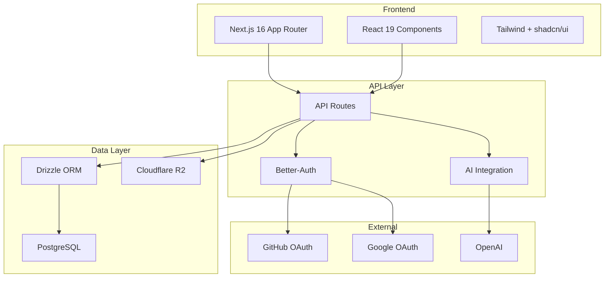

## System Overview



## Architecture at a Glance

| Layer | Technology | Purpose |
| ----- | ---------- | ------- |
| **Frontend** | Next.js 16, React 19 | Server Components, App Router |
| **Styling** | Tailwind CSS, shadcn/ui | Utility-first CSS, accessible components |
| **Backend** | Next.js API Routes | RESTful endpoints |
| **Database** | PostgreSQL, Drizzle ORM | Relational data, type-safe queries |
| **Auth** | Better-Auth | OAuth (GitHub, Google), sessions |
| **Storage** | Cloudflare R2 | Video files, thumbnails |
| **AI** | OpenAI, Vercel AI SDK | Video analysis, summaries |

## Core Components

<CardGroup cols={2}>
  <Card title="Frontend" icon="browser">
    - **Framework:** Next.js 16 with App Router
    - **UI Library:** React 19 with Server Components
    - **Styling:** Tailwind CSS with shadcn/ui components
    - **State:** React hooks and context
    - **Theme:** Dark-first design with next-themes
  </Card>
  <Card title="Backend" icon="server">
    - **API:** RESTful endpoints via Next.js API Routes
    - **Validation:** Effect Schema for request validation
    - **Error Handling:** Effect-TS for type-safe errors
    - **Database:** Drizzle ORM with PostgreSQL
  </Card>
  <Card title="Data" icon="database">
    - **Primary Database:** PostgreSQL (relational)
    - **ORM:** Drizzle with full type safety
    - **File Storage:** Cloudflare R2 (S3-compatible)
    - **Migrations:** Automated with Drizzle Kit
  </Card>
  <Card title="External Services" icon="cloud">
    - **OAuth:** GitHub and Google providers
    - **AI:** OpenAI for video analysis
    - **Storage:** Cloudflare R2 CDN
    - **Deployment:** Vercel Platform
  </Card>
</CardGroup>

## Key Features

| Feature | Implementation |
| ------- | -------------- |
| **Multi-organization** | Organization-based routing with permissions |
| **Video streaming** | R2 storage with CDN distribution |
| **Real-time comments** | Time-stamped, threaded discussions |
| **AI summaries** | OpenAI with structured outputs (Effect Schema) |
| **Role-based access** | Owner, Admin, Member permissions |
| **OAuth login** | GitHub and Google providers |

## Security

<AccordionGroup>
  <Accordion title="Authentication">
    - OAuth 2.0 with GitHub and Google
    - Session-based auth with secure cookies
    - CSRF protection built-in
    - Email verification (optional)
  </Accordion>
  <Accordion title="Authorization">
    - Role-based access control per organization
    - Resource-level permission checks
    - Input validation on all endpoints
  </Accordion>
  <Accordion title="Infrastructure">
    - HTTPS everywhere
    - Environment variable management
    - Database connection pooling
    - SQL injection prevention via ORM
  </Accordion>
</AccordionGroup>

## Performance

<Tabs>
  <Tab title="Frontend">
    | Strategy | Implementation |
    | -------- | -------------- |
    | SSR | Server-side rendering with App Router |
    | Code splitting | Route-based automatic splitting |
    | Image optimization | Next.js Image component |
    | Caching | Static generation where possible |
  </Tab>
  <Tab title="Backend">
    | Strategy | Implementation |
    | -------- | -------------- |
    | Database | Indexed queries, connection pooling |
    | Storage | CDN distribution via R2 |
    | API | Edge-optimized endpoints |
  </Tab>
</Tabs>

## Scalability

<CardGroup cols={2}>
  <Card title="Horizontal" icon="arrows-left-right">
    - Serverless architecture (auto-scaling)
    - CDN for global content delivery
    - Stateless API design
  </Card>
  <Card title="Vertical" icon="arrows-up-down">
    - Query optimization
    - Connection pooling
    - Caching layers (planned)
  </Card>
</CardGroup>

## Documentation Index

<CardGroup cols={2}>
  <Card title="Summary" href="/internal/architecture/summary" icon="list">
    Quick reference (20 key decisions)
  </Card>
  <Card title="Database" href="/internal/architecture/database" icon="database">
    Schema, relationships, indexes
  </Card>
  <Card title="Frontend" href="/internal/architecture/frontend" icon="browser">
    Components, routing, state
  </Card>
  <Card title="Backend" href="/internal/architecture/backend" icon="server">
    API design, validation
  </Card>
  <Card title="Authentication" href="/internal/architecture/authentication" icon="lock">
    Better-Auth, OAuth, sessions
  </Card>
  <Card title="Video Processing" href="/internal/architecture/video-processing" icon="video">
    Upload, streaming, thumbnails
  </Card>
  <Card title="Effect-TS" href="/internal/architecture/effect-ts" icon="code">
    Error handling patterns
  </Card>
  <Card title="Deployment" href="/internal/architecture/deployment" icon="rocket">
    Infrastructure, CI/CD
  </Card>
  <Card title="Security" href="/internal/architecture/security" icon="shield">
    Security architecture
  </Card>
</CardGroup>

## Development Workflow

### Local Setup

```bash
git clone https://github.com/SferaDev/nuclom.git
cd nuclom
pnpm install
cp .env.example .env.local
pnpm db:migrate
pnpm dev
```

### Deployment

<Steps>
  <Step title="Push to main branch">
    Commit and push your changes to the main branch
  </Step>
  <Step title="CI/CD runs tests">
    Automated tests and type checks execute
  </Step>
  <Step title="Deploy to Vercel">
    Application is deployed to Vercel platform
  </Step>
  <Step title="Run migrations">
    Database migrations are applied
  </Step>
  <Step title="Health checks">
    Deployment health is verified
  </Step>
</Steps>

## Related Documentation

<CardGroup cols={3}>
  <Card title="Development Setup" href="/internal/reference/development-setup" icon="wrench">
    Local development guide
  </Card>
  <Card title="API Documentation" href="/public/api" icon="book">
    API reference
  </Card>
  <Card title="User Guides" href="/public/guides/getting-started" icon="graduation-cap">
    Getting started guide
  </Card>
</CardGroup>
