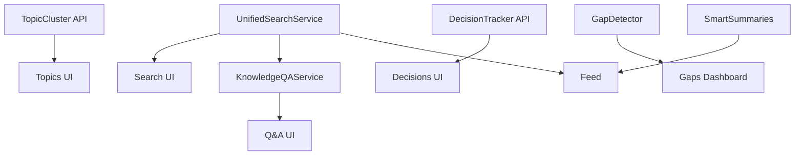

# Knowledge Hub Implementation Plan

## Executive Summary

Based on comprehensive codebase analysis, this document outlines the detailed implementation plan for completing the Knowledge Hub features. The foundation is largely complete - what remains is extending existing capabilities to cover multi-source content.

---

## Current State Assessment

### ✅ Fully Implemented

| Component | Details |
|-----------|---------|
| **Database Schema** | All tables for content sources, integrations, knowledge graph, topic clustering |
| **Content Ingestion** | Slack, Notion, GitHub adapters with OAuth, sync, webhooks |
| **Content Processing** | Embeddings, summaries, key points, decisions extraction |
| **Knowledge Services** | `TopicCluster`, `RelationshipDetector`, `DecisionTracker` |
| **Source Management UI** | `ContentSourcesManager`, `ContentSourceCard`, `AddContentSourceCard` |
| **Video Search** | Keyword, semantic, hybrid search for videos |
| **Knowledge API Routes** | `/api/knowledge/decisions`, `/api/knowledge/graph`, `/api/knowledge/timeline` |

### 🔄 Partially Implemented

| Component | Status | Gap |
|-----------|--------|-----|
| **Hybrid Search** | Works for videos only | Needs extension to content items |
| **Semantic Search** | Works for videos only | Needs extension to content items |
| **Topic Clusters** | Service exists | No API routes or UI |
| **Relationship Detection** | Service exists | No automated workflow |

### ❌ Not Implemented

| Component | Priority |
|-----------|----------|
| **Unified Search Service** | P0 - Enables search UI |
| **AI Q&A Service** | P1 - Core value prop |
| **Knowledge Gap Detection** | P2 - Advanced feature |
| **Smart Summaries** | P2 - Advanced feature |
| **Knowledge Feed** | P1 - New home page |
| **Topics UI** | P1 - Topic exploration |
| **Decisions Dashboard UI** | P1 - Decision tracking |
| **Unified Search UI** | P0 - Multi-source search |

---

## Implementation Phases

### Phase 1: Unified Search Infrastructure (Week 1-2)
**Goal:** Enable searching across all content sources (videos + Slack + Notion + GitHub)

### Phase 2: Knowledge API & Workflows (Week 2-3)
**Goal:** Expose knowledge graph services via API, automate relationship detection

### Phase 3: AI Services (Week 3-4)
**Goal:** Build Q&A, gap detection, and summary generation

### Phase 4: UI Implementation (Week 4-6)
**Goal:** Build Feed, Search, Topics, Decisions views

### Phase 5: Polish & Integration (Week 6-7)
**Goal:** Real-time updates, notifications, testing

---

## Phase 1: Unified Search Infrastructure

### 1.1 Create UnifiedSearchService

**File:** `packages/lib/src/effect/services/search/unified-search.ts`

```typescript
// Service Interface
export interface UnifiedSearchService {
  // Main unified search across all content types
  search(params: UnifiedSearchParams): Effect.Effect<UnifiedSearchResult, SearchError>;

  // Content-specific searches
  searchContentItems(params: ContentSearchParams): Effect.Effect<ContentSearchResult, SearchError>;

  // Faceted search with aggregations
  getFacets(params: FacetParams): Effect.Effect<SearchFacets, SearchError>;

  // Autocomplete suggestions
  getSuggestions(prefix: string, orgId: string): Effect.Effect<SearchSuggestion[], SearchError>;
}

// Input Types
export interface UnifiedSearchParams {
  query: string;
  organizationId: string;

  // Source filtering
  sources?: ('video' | 'slack' | 'notion' | 'github')[];
  sourceIds?: string[];

  // Content type filtering
  contentTypes?: ContentItemType[];

  // Temporal filtering
  dateRange?: { from?: Date; to?: Date };

  // Entity filtering
  participants?: string[];
  topicIds?: string[];
  decisionIds?: string[];

  // Search configuration
  mode?: 'keyword' | 'semantic' | 'hybrid';
  semanticWeight?: number; // 0-1, default 0.5

  // Result options
  groupBy?: 'source' | 'topic' | 'date' | 'participant';
  includeFacets?: boolean;
  includeHighlights?: boolean;

  // Pagination
  limit?: number;
  offset?: number;
}

// Output Types
export interface UnifiedSearchResult {
  results: UnifiedSearchResultItem[];
  facets?: SearchFacets;
  totalCount: number;
  hasMore: boolean;
  searchTimeMs: number;
}

export interface UnifiedSearchResultItem {
  // Can be either a video or a content item
  type: 'video' | 'content_item';
  video?: VideoWithAuthor;
  contentItem?: ContentItem;

  // Scoring
  score: number;
  scoreBreakdown: {
    keywordScore: number;
    semanticScore: number;
    recencyBoost: number;
  };

  // Highlights
  highlights?: {
    title?: string;
    content?: string;
  };

  // Context
  context?: {
    topicCluster?: { id: string; name: string };
    relatedDecision?: { id: string; title: string };
  };
}

export interface SearchFacets {
  sources: Array<{ source: string; count: number }>;
  contentTypes: Array<{ type: string; count: number }>;
  participants: Array<{ name: string; userId?: string; count: number }>;
  topics: Array<{ name: string; clusterId: string; count: number }>;
  dateHistogram: Array<{ date: string; count: number }>;
}
```

**Implementation Strategy:**

1. **Hybrid Search Algorithm:**
   - Generate query embedding
   - Execute keyword search on videos + content items in parallel
   - Execute semantic search on videos + content items in parallel
   - Merge results with configurable weights
   - Apply boosts (recency, engagement)
   - Return paginated, scored results

2. **SQL Queries:**
   - Use PostgreSQL full-text search (tsvector/tsquery) for keyword
   - Use pgvector `<=>` operator for semantic similarity
   - Union queries across `videos` and `content_items` tables

### 1.2 Extend SemanticSearchRepository for Content Items

**File:** `packages/lib/src/effect/services/semantic-search-repository.ts` (modify)

Add methods:
```typescript
// Search content items by embedding
searchContentItems(params: {
  queryEmbedding: number[];
  organizationId: string;
  sourceTypes?: ContentSourceType[];
  contentTypes?: ContentItemType[];
  limit?: number;
  threshold?: number;
}): Effect.Effect<ContentItemSearchResult[], DatabaseError>;

// Combined search across videos and content
searchAll(params: {
  queryEmbedding: number[];
  organizationId: string;
  limit?: number;
  threshold?: number;
}): Effect.Effect<UnifiedSemanticResult[], DatabaseError>;
```

### 1.3 Create Unified Search API Route

**File:** `apps/saas/src/app/(api)/api/search/unified/route.ts`

```typescript
// POST /api/search/unified
export async function POST(request: NextRequest) {
  const effect = Effect.gen(function* () {
    const body = yield* validateRequestBody(UnifiedSearchSchema, request);
    const { user } = yield* authService.getSession(request.headers);

    const searchService = yield* UnifiedSearch;
    return yield* searchService.search({
      ...body,
      organizationId: body.organizationId || user.activeOrganizationId,
    });
  });

  return handleEffectExit(await Effect.runPromiseExit(
    Effect.provide(effect, createFullLayer())
  ));
}
```

### 1.4 Files to Create

| File | Purpose |
|------|---------|
| `packages/lib/src/effect/services/search/unified-search.ts` | Unified search service |
| `packages/lib/src/effect/services/search/index.ts` | Export barrel |
| `apps/saas/src/app/(api)/api/search/unified/route.ts` | Unified search API |
| `apps/saas/src/app/(api)/api/search/facets/route.ts` | Facets API |

---

## Phase 2: Knowledge API & Workflows

### 2.1 Topic Cluster API Routes

**Routes to Create:**

| Route | Method | Purpose |
|-------|--------|---------|
| `/api/knowledge/topics` | GET | List topic clusters |
| `/api/knowledge/topics` | POST | Create manual cluster |
| `/api/knowledge/topics/[id]` | GET | Get cluster with members |
| `/api/knowledge/topics/[id]` | PATCH | Update cluster |
| `/api/knowledge/topics/[id]` | DELETE | Delete cluster |
| `/api/knowledge/topics/[id]/content` | GET | Get cluster content |
| `/api/knowledge/topics/[id]/experts` | GET | Get topic experts |
| `/api/knowledge/topics/trending` | GET | Get trending topics |
| `/api/knowledge/topics/auto-cluster` | POST | Trigger auto-clustering |

**File:** `apps/saas/src/app/(api)/api/knowledge/topics/route.ts`

```typescript
// GET /api/knowledge/topics - List clusters for organization
export async function GET(request: NextRequest) {
  const effect = Effect.gen(function* () {
    const { user } = yield* authService.getSession(request.headers);
    const { searchParams } = new URL(request.url);
    const organizationId = searchParams.get('organizationId') || user.activeOrganizationId;

    const topicClusterService = yield* TopicCluster;
    return yield* topicClusterService.listClusters(organizationId, {
      limit: parseInt(searchParams.get('limit') || '50'),
      offset: parseInt(searchParams.get('offset') || '0'),
    });
  });

  return handleEffectExit(await Effect.runPromiseExit(
    Effect.provide(effect, createFullLayer())
  ));
}

// POST /api/knowledge/topics - Create cluster
export async function POST(request: NextRequest) {
  const effect = Effect.gen(function* () {
    const { user } = yield* authService.getSession(request.headers);
    const body = yield* validateRequestBody(CreateTopicClusterSchema, request);

    const topicClusterService = yield* TopicCluster;
    return yield* topicClusterService.createCluster({
      organizationId: body.organizationId || user.activeOrganizationId,
      name: body.name,
      description: body.description,
      keywords: body.keywords,
    });
  });

  return handleEffectExitWithStatus(await Effect.runPromiseExit(
    Effect.provide(effect, createFullLayer())
  ), 201);
}
```

### 2.2 Relationship Detection Workflow

**File:** `apps/saas/src/workflows/relationship-detection.ts`

```typescript
// Workflow to detect relationships for new content items
export const detectRelationshipsWorkflow = workflow({
  id: 'detect-relationships',
  trigger: trigger.event('content.item.created'),

  run: async (ctx, event) => {
    const { contentItemId, organizationId } = event.data;

    // Step 1: Get the content item
    const item = await ctx.run('get-item', async () => {
      return getContentItem(contentItemId);
    });

    if (!item?.embeddingVector) {
      return { skipped: true, reason: 'no_embedding' };
    }

    // Step 2: Detect relationships using all strategies
    const candidates = await ctx.run('detect-relationships', async () => {
      return detectRelationshipsForItem(contentItemId, {
        strategies: ['explicit', 'semantic', 'temporal', 'entity'],
        minConfidence: 0.6,
        limit: 20,
      });
    });

    // Step 3: Create high-confidence relationships
    const created = await ctx.run('create-relationships', async () => {
      const highConfidence = candidates.filter(c => c.confidence >= 0.7);
      return createRelationships(highConfidence);
    });

    // Step 4: Assign to topic cluster
    const cluster = await ctx.run('assign-cluster', async () => {
      return findAndAssignBestCluster(contentItemId);
    });

    return {
      relationships: created.length,
      clusterId: cluster?.clusterId,
      candidates: candidates.length,
    };
  },
});
```

### 2.3 Auto-Clustering Workflow

**File:** `apps/saas/src/workflows/topic-clustering.ts`

```typescript
// Scheduled workflow to rebuild topic clusters
export const topicClusteringWorkflow = workflow({
  id: 'rebuild-topic-clusters',
  trigger: trigger.cron('0 3 * * *'), // Daily at 3 AM

  run: async (ctx) => {
    // Get all organizations with content
    const orgs = await ctx.run('get-orgs', async () => {
      return getOrganizationsWithContent();
    });

    const results = [];

    for (const org of orgs) {
      // Run auto-clustering for each org
      const result = await ctx.run(`cluster-${org.id}`, async () => {
        return autoClusterContent({
          organizationId: org.id,
          minClusterSize: 3,
          maxClusters: 30,
          similarityThreshold: 0.7,
          useAI: true,
        });
      });

      // Save clusters to database
      await ctx.run(`save-clusters-${org.id}`, async () => {
        return saveClusters(org.id, result.clusters);
      });

      // Update expertise scores
      await ctx.run(`update-expertise-${org.id}`, async () => {
        return updateAllExpertiseScores(org.id);
      });

      results.push({
        organizationId: org.id,
        clusters: result.clusters.length,
        unclustered: result.unclusteredItems.length,
      });
    }

    return { organizations: results.length, results };
  },
});
```

### 2.4 Files to Create

| File | Purpose |
|------|---------|
| `apps/saas/src/app/(api)/api/knowledge/topics/route.ts` | List/create clusters |
| `apps/saas/src/app/(api)/api/knowledge/topics/[id]/route.ts` | Cluster CRUD |
| `apps/saas/src/app/(api)/api/knowledge/topics/[id]/content/route.ts` | Cluster content |
| `apps/saas/src/app/(api)/api/knowledge/topics/[id]/experts/route.ts` | Topic experts |
| `apps/saas/src/app/(api)/api/knowledge/topics/trending/route.ts` | Trending topics |
| `apps/saas/src/app/(api)/api/knowledge/topics/auto-cluster/route.ts` | Trigger clustering |
| `apps/saas/src/app/(api)/api/knowledge/relationships/route.ts` | Relationship queries |
| `apps/saas/src/workflows/relationship-detection.ts` | Auto-detect workflow |
| `apps/saas/src/workflows/topic-clustering.ts` | Clustering workflow |

---

## Phase 3: AI Services

### 3.1 Knowledge Q&A Service

**File:** `packages/lib/src/effect/services/ai/knowledge-qa.ts`

```typescript
export interface KnowledgeQAService {
  // Answer a question using organizational knowledge
  askQuestion(params: QAParams): Effect.Effect<QAResponse, QAError>;

  // Follow-up question in conversation context
  askFollowUp(params: FollowUpParams): Effect.Effect<QAResponse, QAError>;

  // Get suggested follow-up questions
  suggestFollowUps(answer: string, sources: ContentItem[]): Effect.Effect<string[], QAError>;
}

export interface QAParams {
  organizationId: string;
  question: string;

  // Optional constraints
  sourceTypes?: ContentSourceType[];
  timeRange?: { from?: Date; to?: Date };
  maxSources?: number; // Default 10

  // Conversation context
  conversationId?: string;
  previousMessages?: Array<{ role: 'user' | 'assistant'; content: string }>;
}

export interface QAResponse {
  answer: string;
  confidence: number;
  reasoning: string;

  sources: Array<{
    contentItem: ContentItem;
    excerpt: string;
    relevance: number;
    usedFor: 'primary' | 'supporting' | 'context';
  }>;

  uncertainties: Array<{
    aspect: string;
    reason: 'missing_info' | 'conflicting_info' | 'outdated' | 'low_confidence';
    suggestion: string;
  }>;

  followUpQuestions: string[];
  relatedTopics: string[];
  conversationId: string;
}
```

**Implementation:**

```typescript
const makeKnowledgeQAService = (
  unifiedSearch: UnifiedSearchService,
  embedding: EmbeddingService,
  ai: AIService,
): KnowledgeQAService => ({
  askQuestion: (params) =>
    Effect.gen(function* () {
      const { organizationId, question, sourceTypes, timeRange, maxSources = 10 } = params;

      // 1. Generate question embedding
      const questionEmbedding = yield* embedding.generateEmbedding(question);

      // 2. Retrieve relevant content using semantic search
      const searchResult = yield* unifiedSearch.search({
        query: question,
        organizationId,
        sources: sourceTypes,
        dateRange: timeRange,
        mode: 'hybrid',
        semanticWeight: 0.7, // Weight semantic more for Q&A
        limit: maxSources * 2, // Get extra to filter
        includeHighlights: true,
      });

      // 3. Re-rank and select top sources
      const relevantContent = searchResult.results
        .slice(0, maxSources)
        .map(r => ({
          item: r.contentItem || r.video,
          score: r.score,
          highlights: r.highlights,
        }));

      // 4. Build context for AI
      const context = relevantContent.map((c, i) => ({
        index: i,
        type: c.item.type,
        title: c.item.title,
        content: c.item.content?.slice(0, 2000),
        date: c.item.createdAt,
        source: c.item.sourceType || 'video',
      }));

      // 5. Generate answer using AI
      const prompt = buildQAPrompt(question, context, params.previousMessages);
      const aiResult = yield* ai.generateText(prompt).pipe(
        Effect.mapError(e => new QAError({ message: e.message, cause: e }))
      );

      // 6. Parse AI response
      const parsed = parseQAResponse(aiResult);

      // 7. Map source references
      const sources = parsed.sourceIndices.map(i => ({
        contentItem: relevantContent[i]?.item,
        excerpt: relevantContent[i]?.highlights?.content || '',
        relevance: relevantContent[i]?.score || 0,
        usedFor: i === 0 ? 'primary' : 'supporting',
      })).filter(s => s.contentItem);

      return {
        answer: parsed.answer,
        confidence: parsed.confidence,
        reasoning: parsed.reasoning,
        sources,
        uncertainties: parsed.uncertainties || [],
        followUpQuestions: parsed.followUpQuestions || [],
        relatedTopics: parsed.relatedTopics || [],
        conversationId: params.conversationId || generateId(),
      };
    }),

  // ... other methods
});
```

### 3.2 Gap Detection Service

**File:** `packages/lib/src/effect/services/ai/gap-detector.ts`

```typescript
export interface GapDetectorService {
  // Run all gap detection algorithms
  detectGaps(organizationId: string): Effect.Effect<KnowledgeGap[], GapDetectionError>;

  // Specific gap types
  findUndocumentedTopics(orgId: string): Effect.Effect<UndocumentedTopic[], GapDetectionError>;
  findUnimplementedDecisions(orgId: string, thresholdDays?: number): Effect.Effect<UnimplementedDecision[], GapDetectionError>;
  findStaleDocumentation(orgId: string, thresholdDays?: number): Effect.Effect<StaleDoc[], GapDetectionError>;
  findKnowledgeSilos(orgId: string): Effect.Effect<KnowledgeSilo[], GapDetectionError>;
  findConflictingInfo(orgId: string): Effect.Effect<ConflictingInfo[], GapDetectionError>;

  // Dismiss a gap
  dismissGap(gapId: string, reason: string): Effect.Effect<void, GapDetectionError>;
}

export interface KnowledgeGap {
  id: string;
  type: GapType;
  severity: 'high' | 'medium' | 'low';
  title: string;
  description: string;
  affectedTopics: string[];
  suggestedActions: string[];
  evidence: GapEvidence[];
  detectedAt: Date;
}

type GapType =
  | 'undocumented_topic'       // Discussed but not documented
  | 'unimplemented_decision'   // Decided but not implemented
  | 'stale_documentation'      // Doc not updated after related changes
  | 'knowledge_silo'           // Only one person knows
  | 'conflicting_info'         // Multiple sources disagree
  | 'orphaned_content'         // Content with no connections
  | 'missing_decision';        // Implementation without documented decision
```

**SQL for Undocumented Topics:**
```sql
-- Topics discussed in Slack/meetings but not in Notion
SELECT
  tc.id as topic_id,
  tc.name as topic_name,
  COUNT(CASE WHEN ci.type IN ('message', 'thread', 'video') THEN 1 END) as discussion_count,
  COUNT(CASE WHEN ci.type IN ('document') THEN 1 END) as doc_count
FROM topic_clusters tc
JOIN topic_cluster_members tcm ON tcm.cluster_id = tc.id
JOIN content_items ci ON ci.id = tcm.content_item_id
WHERE tc.organization_id = $1
GROUP BY tc.id, tc.name
HAVING
  COUNT(CASE WHEN ci.type IN ('message', 'thread', 'video') THEN 1 END) > 5
  AND COUNT(CASE WHEN ci.type IN ('document') THEN 1 END) = 0
```

### 3.3 Smart Summary Service

**File:** `packages/lib/src/effect/services/ai/smart-summaries.ts`

```typescript
export interface SmartSummaryService {
  // Digests
  generateDailyDigest(userId: string, orgId: string): Effect.Effect<Digest, SummaryError>;
  generateWeeklyDigest(userId: string, orgId: string): Effect.Effect<Digest, SummaryError>;

  // Topic summaries
  summarizeTopic(topicId: string, depth?: 'brief' | 'detailed'): Effect.Effect<TopicSummary, SummaryError>;

  // Decision summaries
  summarizeDecision(decisionId: string): Effect.Effect<DecisionSummary, SummaryError>;

  // Contextual summaries
  generateMeetingPrep(params: MeetingPrepParams): Effect.Effect<MeetingPrep, SummaryError>;
  generateOnboardingSummary(params: OnboardingParams): Effect.Effect<OnboardingSummary, SummaryError>;
}

export interface Digest {
  period: { from: Date; to: Date };
  highlights: DigestSection[];
  decisions: DecisionHighlight[];
  trendingTopics: TrendingTopic[];
  actionItems: ActionItem[];
  recommendations: string[];
}
```

### 3.4 Files to Create

| File | Purpose |
|------|---------|
| `packages/lib/src/effect/services/ai/knowledge-qa.ts` | Q&A service |
| `packages/lib/src/effect/services/ai/gap-detector.ts` | Gap detection |
| `packages/lib/src/effect/services/ai/smart-summaries.ts` | Summaries |
| `packages/lib/src/effect/services/ai/index.ts` | Export barrel |
| `apps/saas/src/app/(api)/api/ai/qa/ask/route.ts` | Q&A endpoint |
| `apps/saas/src/app/(api)/api/ai/qa/followup/route.ts` | Follow-up endpoint |
| `apps/saas/src/app/(api)/api/ai/gaps/route.ts` | Gaps endpoint |
| `apps/saas/src/app/(api)/api/ai/summaries/digest/route.ts` | Digest endpoint |
| `apps/saas/src/app/(api)/api/ai/summaries/topic/[id]/route.ts` | Topic summary |
| `apps/saas/src/app/(api)/api/ai/summaries/meeting-prep/route.ts` | Meeting prep |

---

## Phase 4: UI Implementation

### 4.1 Navigation Restructure

**Current:** Videos, Channels, Profile
**Target:** Feed, Search, Sources, Topics, Decisions, Settings

**File:** `apps/saas/src/components/navigation/knowledge-hub-nav.tsx`

```typescript
const navigationItems = [
  { name: 'Feed', href: '/feed', icon: HomeIcon },
  { name: 'Search', href: '/search', icon: SearchIcon },
  { name: 'Sources', href: '/sources', icon: DatabaseIcon },
  { name: 'Topics', href: '/topics', icon: TagIcon },
  { name: 'Decisions', href: '/decisions', icon: CheckCircleIcon },
];
```

### 4.2 Knowledge Feed View

**File:** `apps/saas/src/app/(app)/feed/page.tsx`

**Components:**
- `KnowledgeFeed` - Main container with infinite scroll
- `FeedItem` - Polymorphic item (discussion, decision, content, trending)
- `FeedFilters` - Source, topic, participant filters

**Data Sources:**
- Recent content items (sorted by activity)
- Active decisions (proposed, in discussion)
- Trending topics
- New relationships discovered

### 4.3 Unified Search View

**File:** `apps/saas/src/app/(app)/search/page.tsx`

**Components:**
- `UnifiedSearchBar` - With autocomplete
- `SearchFilters` - Advanced filter panel
- `SearchResults` - Grouped by source type
- `SearchResultCard` - Per-result card with highlights
- `SearchFacets` - Sidebar with facet filters

### 4.4 Topics View

**File:** `apps/saas/src/app/(app)/topics/page.tsx`

**Components:**
- `TopicList` - Grid of topic cards
- `TopicCard` - Summary with stats
- `TrendingTopics` - Sidebar widget

**File:** `apps/saas/src/app/(app)/topics/[id]/page.tsx`

**Components:**
- `TopicExplorer` - Full topic view
- `TopicActivity` - Activity timeline
- `TopicExperts` - Expert list
- `TopicContent` - Related content
- `RelatedTopics` - Similar topics

### 4.5 Decisions View

**File:** `apps/saas/src/app/(app)/decisions/page.tsx`

**Components:**
- `DecisionDashboard` - Kanban-style board
- `DecisionCard` - Status, owner, timeline
- `DecisionFilters` - Status, owner, topic filters

**File:** `apps/saas/src/app/(app)/decisions/[id]/page.tsx`

**Components:**
- `DecisionDetail` - Full decision view
- `DecisionTimeline` - Visual lifecycle
- `DecisionEvidence` - Supporting content
- `DecisionParticipants` - Who was involved

### 4.6 Content Viewers

**File:** `apps/saas/src/components/content/content-viewer.tsx`

Polymorphic viewer that renders:
- Slack messages/threads
- Notion pages
- GitHub PRs/Issues/Discussions
- Videos (existing)

### 4.7 Files to Create

| File | Purpose |
|------|---------|
| **Navigation** | |
| `apps/saas/src/components/navigation/knowledge-hub-nav.tsx` | New navigation |
| **Feed** | |
| `apps/saas/src/app/(app)/feed/page.tsx` | Feed page |
| `apps/saas/src/components/feed/knowledge-feed.tsx` | Feed container |
| `apps/saas/src/components/feed/feed-item.tsx` | Polymorphic item |
| `apps/saas/src/components/feed/feed-filters.tsx` | Filter bar |
| **Search** | |
| `apps/saas/src/app/(app)/search/page.tsx` | Search page |
| `apps/saas/src/components/search/unified-search-bar.tsx` | Search input |
| `apps/saas/src/components/search/search-filters.tsx` | Filter panel |
| `apps/saas/src/components/search/search-results.tsx` | Results list |
| `apps/saas/src/components/search/search-facets.tsx` | Facet sidebar |
| **Topics** | |
| `apps/saas/src/app/(app)/topics/page.tsx` | Topics list page |
| `apps/saas/src/app/(app)/topics/[id]/page.tsx` | Topic detail page |
| `apps/saas/src/components/topics/topic-list.tsx` | Topic grid |
| `apps/saas/src/components/topics/topic-card.tsx` | Topic card |
| `apps/saas/src/components/topics/topic-explorer.tsx` | Full topic view |
| `apps/saas/src/components/topics/topic-experts.tsx` | Expert list |
| **Decisions** | |
| `apps/saas/src/app/(app)/decisions/page.tsx` | Decisions page |
| `apps/saas/src/app/(app)/decisions/[id]/page.tsx` | Decision detail |
| `apps/saas/src/components/decisions/decision-dashboard.tsx` | Dashboard |
| `apps/saas/src/components/decisions/decision-card.tsx` | Decision card |
| `apps/saas/src/components/decisions/decision-timeline.tsx` | Visual timeline |
| **Content** | |
| `apps/saas/src/components/content/content-card.tsx` | Generic content card |
| `apps/saas/src/components/content/content-viewer.tsx` | Polymorphic viewer |
| `apps/saas/src/components/content/slack-message-view.tsx` | Slack viewer |
| `apps/saas/src/components/content/notion-page-view.tsx` | Notion viewer |
| `apps/saas/src/components/content/github-item-view.tsx` | GitHub viewer |

---

## Phase 5: Polish & Integration

### 5.1 Real-time Updates

- WebSocket connection for live feed updates
- Server-Sent Events for sync progress
- Optimistic UI updates

### 5.2 Notifications

- Decision status changes
- New content in followed topics
- Knowledge gaps detected
- Mentioned in discussions

### 5.3 Testing

| Type | Coverage |
|------|----------|
| Unit Tests | All services (search, Q&A, gaps, summaries) |
| Integration Tests | API routes end-to-end |
| E2E Tests | Critical user flows (search, view topic, track decision) |

### 5.4 Performance Targets

| Operation | Target |
|-----------|--------|
| Unified search | < 500ms |
| Q&A response | < 3s |
| Feed load | < 300ms |
| Topic detail | < 200ms |
| Autocomplete | < 100ms |

---

## Implementation Order

### Week 1
1. Create `UnifiedSearchService`
2. Extend `SemanticSearchRepository` for content items
3. Create `/api/search/unified` route
4. Test unified search end-to-end

### Week 2
1. Create topic cluster API routes
2. Create relationship detection workflow
3. Create auto-clustering workflow
4. Test knowledge graph APIs

### Week 3
1. Implement `KnowledgeQAService`
2. Create Q&A API routes
3. Implement basic `GapDetectorService`
4. Test AI services

### Week 4
1. Implement `SmartSummaryService`
2. Create summary API routes
3. Build navigation restructure
4. Build Feed page MVP

### Week 5
1. Build Search page with filters
2. Build Topics list and detail pages
3. Build Decisions dashboard
4. Build content viewers

### Week 6
1. Build Decision detail page
2. Polish all UIs
3. Add real-time updates
4. Add notifications

### Week 7
1. Comprehensive testing
2. Performance optimization
3. Documentation updates
4. Bug fixes

---

## Dependencies



---

## Risk Mitigation

| Risk | Mitigation |
|------|------------|
| Search performance with large datasets | Use connection pooling, query optimization, caching |
| AI costs for Q&A/summaries | Rate limiting, caching responses, usage quotas |
| Schema complexity | Keep existing schema, add views for cross-cutting queries |
| Migration path for existing users | Gradual rollout, feature flags, backward compatibility |

---

## Success Metrics

| Metric | Target |
|--------|--------|
| Unified search adoption | 50% of searches use unified search within 2 weeks |
| Q&A usage | 20% of users try Q&A within 1 week |
| Topic cluster coverage | 80% of content items in clusters |
| Decision tracking | 30% of decisions tracked end-to-end |
| Feed engagement | 60% daily return rate to feed |
